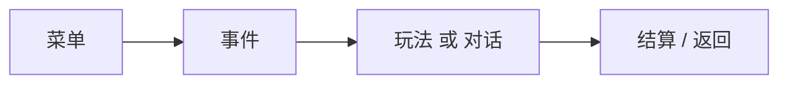

# 剧本编辑器新手上手手册

> 适用范围：`mod-first-dev` 分支当前可见的剧本编辑器  
> 文档目标：让第一次接触这套编辑器的创作者，能在最短时间内做出一条“能点、能进、能跑”的内容闭环

## 1. 先记住这件事

第一次上手，不要追求做完整大剧情。  
你只要先做通下面这个最小闭环，就已经入门了：

你的第一轮目标不是“做完整剧本”，而是：

1. 做出一个入口
2. 让它能跳到内容
3. 让内容能正常结束

## 2. 最推荐的进入方式

### 第一步：从主菜单进入 `剧本编辑`

### 第二步：第一次使用，优先点 `使用模板`

为什么不建议新手一开始点 `新建剧本`：

- 空项目不容易理解结构
- 你会不知道应该先建什么
- 很容易把“模块职责”搞混

为什么推荐 `使用模板`：

- 直接给你一套能看懂的真实项目
- 左边已经有人物、城市、菜单、事件、玩法这些对象
- 你可以一边看一边学、一边改一边测

## 3. 进入工作台后先看哪里

进入工作台后，先只认识 3 个位置：

### 3.1 左边：模块入口

这里决定你现在在编辑什么。

第一次最值得看的模块顺序是：

1. `项目信息`
2. `人物`
3. `事件`
4. `菜单`
5. `玩法`
6. `结算`

### 3.2 中间：当前模块的编辑区

通常分成两半：

- 左侧小列表：已有对象
- 右侧详情：当前对象怎么填

### 3.3 上面：最常用的三个按钮

- `项目信息`
- `运行预览`
- `剧本导出`

新手最常用的是 `运行预览`，不是 `剧本导出`。

## 4. 新手建议的实际操作顺序

第一次上手，请严格按下面顺序来：

1. 先看 `项目信息`
2. 再看 `人物`
3. 再看 `事件`
4. 再看 `菜单`
5. 再看 `玩法`
6. 最后再考虑 `结算`

原因是：

- `项目信息` 决定这个剧本从哪开始
- `人物` 让你先看懂对象怎么建
- `事件` 让你理解流程怎么接
- `菜单` 让你理解入口从哪来
- `玩法` 让你理解可玩内容怎么挂进去
- `结算` 最后再学，不容易乱

## 5. 先看 `项目信息`

模板项目加载后，中间默认就是项目信息区域。

你会看到这些字段：

- 项目标题
- 剧本包标题
- 开场场景标题
- 开局视图
- 开局城市
- 开局建筑
- 角色选择策略
- 默认角色

第一次上手时，你不用急着改全部。  
你只要先理解：

- 这个剧本从哪里开始
- 玩家是怎么进入游戏的
- 默认角色是谁

## 6. 人物怎么改

点击左边 `人物` 后，你会看到：

- 左边：人物列表
- 右边：人物详情

### 6.1 第一次先做什么

先选一个你认识的角色，例如模板里的 `朱元璋`，只看右边内容，不要急着改。

你先认识这些字段：

- `人物名称`
- `人物类型`
- `所属城市`
- `所属建筑`
- `人物立绘`
- `人物简介`
- `自定义属性`

### 6.2 新增人物怎么做

人物页左边有两个常用按钮：

- `新增人物`
- `删除人物`

正确做法：

1. 先点 `新增人物`
2. 先填基础信息
3. 再补自定义属性

新手不要一开始就疯狂加属性。  
先把“这个人是谁、在哪、长什么样”补完整更重要。

### 6.3 人物页最常见的用法

人物页最适合拿来做这些内容：

- 新增 NPC
- 补角色归属
- 设定人物在城市或建筑里的位置
- 补人物说明
- 给角色补创作属性

## 7. 事件怎么改

点击左边 `事件` 后，你会看到事件列表和事件详情。

### 7.1 先记住事件的作用

对新手来说，事件可以理解成：

> “这一步发生什么，以及下一步去哪里”

### 7.2 第一次重点看哪些字段

你先只看这些：

- `事件标题`
- `事件类型`
- `后续事件`
- `去向类型`
- `去向目标`

这几个字段已经足够你理解流程了。

### 7.3 事件最适合拿来做什么

最适合做这些：

- 菜单点下去后进入某段内容
- 一段内容结束后跳下一段
- 把流程导向玩法
- 把流程导向对话

### 7.4 新手第一轮不要追求什么

不要一开始就试图把事件写成复杂脚本。  
你先把它当成“流程接线点”最容易学会。

## 8. 菜单怎么改

点击 `菜单` 后，你会看到：

- 左边：菜单项列表
- 右边：菜单详情

### 8.1 菜单最重要的两个字段

你第一眼只盯住：

- `菜单名称`
- `目标对象`

### 8.2 新手该怎么理解菜单

菜单不是剧情本体。  
菜单是“玩家能点到的按钮”。

所以你在菜单里做的事，本质上是：

1. 给按钮命名
2. 告诉它点下去去哪

### 8.3 新手练习建议

最适合第一次练习的是：

1. 新增一个菜单项
2. 给它起一个容易识别的名字
3. 把它的目标对象指向一条你认识的事件

这样你就能最快理解“入口 -> 内容”的关系。

## 9. 玩法怎么改

点击 `玩法` 后，当前界面里你会看到：

- `绑定标题`
- `玩法原型`
- `接入方案`
- `结算实例`

### 9.1 新手先怎么理解玩法

玩法不是玩家直接看到的世界入口，而是“被流程调用出来的可玩内容”。

你可以把它理解成：

- 菜单：玩家点按钮
- 事件：负责承接和跳转
- 玩法：真的开始玩

### 9.2 第一次上手时重点看什么

先看：

- `绑定标题`
- `玩法原型`

你先知道“这条玩法在项目里叫什么”和“它用的是哪种玩法原型”，就够了。

### 9.3 当前页面要特别注意

当前版本里，玩法页还保留了：

- `接入方案`
- `结算实例`

所以你在实际使用时，要按当前真实页面填写，不要先假设它已经被简化掉。

## 10. 结算怎么理解

当前模板项目里的结算页是空的。  
这对新手来说反而是好事，因为你不会一开始就被复杂结果收尾吓到。

你先这样理解就行：

> 结算是“这一步结束后，最后发生什么”的地方。

例如未来常见的收尾都可能放在这里：

- 奖励
- 扣除
- 状态变化
- 后续结果

## 11. 第一次上手最推荐做的练习

下面是最适合第一次真正动手的一套练习。

### 练习目标

做出一条最小流程：

`菜单 -> 事件 -> 玩法`

### 练习步骤

#### 第 1 步：先看模板里已有玩法

去 `玩法` 页面，看当前已有的 `化缘`。  
先不要改，先看它的：

- 绑定标题
- 玩法原型

目的：知道项目里已经有什么玩法对象。

#### 第 2 步：去看一条事件

去 `事件` 页面，打开一条和玩法相关的事件。  
看它的：

- 去向类型
- 去向目标

目的：理解事件是怎么把流程导向玩法的。

#### 第 3 步：去看菜单

去 `菜单` 页面，看一个现成菜单项，比如 `化缘`。  
确认它的：

- 菜单名称
- 目标对象

目的：理解玩家入口是怎么接到事件上的。

#### 第 4 步：运行预览

回到上面点 `运行预览`。  
这一轮你的目的不是通关玩法，而是确认：

1. 能否进入运行预览
2. 能否看到对应入口
3. 点下后是否能进到预期内容

### 这套练习为什么最好

因为它让你在最短时间内同时看懂 3 件事：

- 菜单是入口
- 事件是承接
- 玩法是可玩内容

## 12. 新手什么时候该新增对象

第一次上手时，不要一进来就大量新增。

最合理顺序是：

1. 先看模板现成内容
2. 看懂每个模块各自放什么
3. 再新增第一个对象

建议新增顺序：

1. 先新增一个菜单项
2. 再新增一条事件
3. 最后再新增一条玩法绑定

因为这样最容易看到结果。

## 13. 什么时候点 `运行预览`

请养成这个习惯：

- 改完一个小闭环就预览一次

不要等你做了十几处改动后才第一次预览。

最好的节奏是：

1. 改一点
2. 预览
3. 确认
4. 再继续改

## 14. 什么时候点 `剧本导出`

只有在下面几件事都已经确认过后，才建议导出：

- 入口能找到
- 菜单能点
- 事件能接
- 玩法能进
- 流程不会卡死

对新手来说，`剧本导出` 是收尾按钮，不是日常测试按钮。

## 15. 最容易踩的坑

### 15.1 一开始就从零建空项目

结果通常是：

- 不知道先建什么
- 不知道模块怎么配合
- 很快失去方向

### 15.2 把菜单当成剧情本体

菜单只是入口，不是主流程。

### 15.3 把玩法当成入口

玩法通常是被调用的内容，不是直接摆在最外层当主入口来理解的。

### 15.4 不预览，直接导出

这样最容易积累一堆问题最后一起爆出来。

### 15.5 一口气新增太多对象

第一次上手，最怕的不是不会填，而是把关系搞乱。  
少量、小步、边做边看最有效。

## 16. 一条真正适合新手的建议

如果今天你只想完成一件有价值的事，请只做这个：

> 用模板项目看懂一条“菜单 -> 事件 -> 玩法”的现成流程，然后自己照着再做一条新的。

做到这一步，你就已经不是“没用过编辑器的人”了，而是已经能开始独立搭内容的人。
