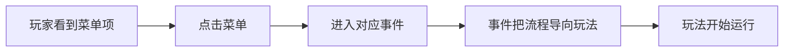
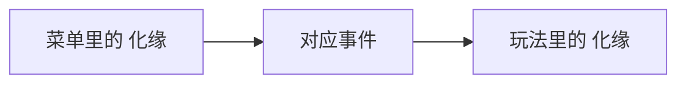
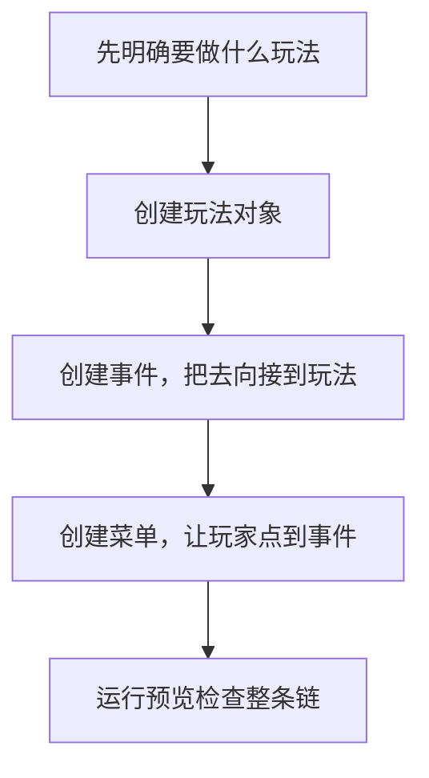

# 剧本编辑器实例演练：做一条“菜单 -> 事件 -> 玩法”流程

> 适用范围：`mod-first-dev` 分支当前可见的剧本编辑器  
> 文档目标：带第一次上手的创作者，照着模板项目看懂一条真实流程，并学会自己仿做一条新的入口链路

## 1. 这份文档适合什么时候看

如果你已经看过：

- [剧本编辑器功能说明](./script-editor-feature-overview.md)
- [剧本编辑器新手上手手册](./script-editor-beginner-handbook.md)

但还是会有这种感觉：

- 我知道模块名字了，但还是不知道一条流程到底怎么串起来
- 我知道菜单、事件、玩法是分开的，但不知道该先改哪一个
- 我想照着做一遍真实例子

那这份文档就是给你的。

## 2. 本次演练目标

我们不追求做完整剧情，只完成一个最小可跑通的例子：

你可以把这份文档理解成：

> 学会怎么从“一个玩家能点的按钮”，一路接到“真正开始玩的内容”。

## 3. 这次不从空白开始，而是先拆模板

第一次练习时，不建议你从零开始造一整条新链路。  
最稳妥的方法是：

1. 先在模板里找到一条已经存在的流程
2. 先看懂它
3. 再模仿它做新的

当前模板项目里，最适合拿来理解的现成例子就是：

- 菜单项：`化缘`
- 对应玩法：`化缘`

## 4. 进入模板项目

### 第一步：进入 `剧本编辑`

### 第二步：点击 `使用模板`

第一次做实例演练时，不要点 `新建剧本`。  
你需要的是一套已经搭好的可参考样板，而不是空项目。

### 第三步：进入工作台

进入后，先只记住：

- 左边是模块入口
- 中间是当前模块的编辑区
- 上面有 `运行预览`

## 5. 先找“玩家会点到的入口”

### 第一步：点击左边 `菜单`

进入菜单模块后，你要找的是：

- 左边列表里的 `化缘`

### 第二步：看右侧两个字段

当前这一步你只关心两个东西：

- `菜单名称`
- `目标对象`

这两个字段决定的是：

1. 玩家最终看到按钮叫什么
2. 玩家点下去后，会进入哪条内容

### 第三步：理解这一页在做什么

这一步不是在写剧情，也不是在做玩法。  
你在做的是：

> 给玩家一个可见入口，并把入口指向某个目标对象。

所以第一次演练时，请先牢牢记住：

**菜单负责“给玩家点”，不负责“把所有逻辑写完”。**

## 6. 再找“流程中转站”

### 第一步：点击左边 `事件`

现在你进入的是整条链路里最关键的一层。

### 第二步：在事件里找和目标相对应的那条内容

你在菜单里看到 `目标对象` 后，就要到事件模块里找对应事件。

这一步你的主要任务不是修改，而是确认三件事：

1. 这条事件确实存在
2. 它的名字你能认出来
3. 它后面确实还会继续往下走

### 第三步：先看这几个字段

第一次只看：

- `事件标题`
- `事件类型`
- `后续事件`
- `去向类型`
- `去向目标`

在实例演练里，这几个字段已经够你理解流程了。

### 第四步：理解事件这一层的作用

事件不是玩家入口，但它是整个流程的中转站。  
可以这样记：

- 菜单：让玩家点
- 事件：决定往哪里走
- 玩法：真正开始玩

所以这里的核心问题永远是：

> “这一条内容做完后，下一步去哪？”

## 7. 最后找“真正开始玩的内容”

### 第一步：点击左边 `玩法`

现在你看到的是剧本里可调用的玩法对象，而不是玩法机制源码。

### 第二步：在左边列表找到 `化缘`

这是当前模板里已经存在的一条玩法绑定。

### 第三步：看右边四个字段

当前版本里，玩法页仍然有：

- `绑定标题`
- `玩法原型`
- `接入方案`
- `结算实例`

这意味着对创作者来说，这一页当前要回答的是：

1. 这条玩法在项目里叫什么
2. 它实际调用哪种玩法原型
3. 它通过哪种方式接入
4. 它结束后交给哪个结算对象

### 第四步：理解玩法层的定位

这一步最容易搞混。

你现在看到的不是“菜单按钮”，也不是“整个剧情流程”。  
你现在配置的是：

> 当流程走到这里时，具体启动哪一个可玩内容。

所以玩法页不是主入口，而是被调用的内容页。

## 8. 把这一条链路完整记住

把刚才三页连起来，你就能得到这条最关键的理解：

也就是说，真正的创作顺序，不是“先做玩法，再让玩家直接点玩法”，而是：

1. 先准备好玩法对象
2. 用事件把流程导向它
3. 再用菜单给玩家一个入口

对新手来说，这句话很重要：

> 玩家通常点到的是菜单，流程通常靠事件承接，真正开始玩时才进入玩法。

## 9. 第一次自己仿做一条新流程，应该怎么做

下面这部分不是讲模板已有内容，而是教你怎么模仿它做一条新的。

## 9.1 先决定你要做的是什么

不要一上来边点边想。  
先用一句话写下来：

> “我想做一个菜单项，玩家点击后，进入一条事件，再进入某个玩法。”

只要一句话就够。

例如：

- `寺院工作`
- `街头打听`
- `账目练习`

## 9.2 先做玩法

为什么先做玩法？  
因为这是整条链最具体的目标，如果连“要启动哪种玩法”都没定，前面事件和菜单就没有落点。

在 `玩法` 页里，你第一次新增时最建议只做两件事：

1. 填 `绑定标题`
2. 选 `玩法原型`

先把玩法对象建立起来，别急着一次把所有字段都做到最复杂。

## 9.3 再做事件

玩法建好后，到 `事件` 页新增一条事件。

你这时要解决的是：

- 这条事件叫什么
- 它最终去向是不是 `玩法`
- 去向目标是不是你刚建的那条玩法

所以这一步的重点不是“写很多说明”，而是把跳转关系接上。

## 9.4 最后做菜单

当玩法和事件都已经准备好后，再回到 `菜单` 页新增一个菜单项。

此时你只需要做两件事：

1. 起一个玩家看得懂的按钮名字
2. 把 `目标对象` 指向你刚做好的事件

这样，整条链路就闭合了。

## 10. 为什么推荐这个顺序

推荐顺序是：

1. 玩法
2. 事件
3. 菜单

原因不是技术原因，而是创作效率：

- 玩法先定，目标明确
- 事件中转，流程清楚
- 菜单最后接，入口自然

如果你倒着做，很容易出现这种情况：

- 菜单先起好了，但后面没有内容能接
- 事件先建了，但去向目标还没想清
- 最后到玩法时，前面两层又要返工

## 11. 做完后一定要预览

当你完成一条 `菜单 -> 事件 -> 玩法` 链路后，不要继续往下堆内容。  
先做一件事：

### 点上方 `运行预览`

你这一次预览的目标很简单：

1. 能不能进入运行预览
2. 能不能找到你新做的入口
3. 点下去能不能进到对应内容
4. 流程会不会卡住

注意：第一次预览不是为了“完整玩好”，而是为了确认链路通不通。

## 12. 这次实例演练里你最应该学会的，不是字段，而是顺序

这份演练真正想让你掌握的是下面这个顺序：

只要你掌握这个顺序，后面你无论做：

- 新菜单入口
- 新任务入口
- 新玩法接入
- 新剧情中转

都会顺很多。

## 13. 新手最常见的错误

### 13.1 一上来先做菜单

这样最容易导致：

- 菜单名字起好了
- 但后面没有目标可以接

### 13.2 把事件当成备注页

事件页不是只拿来写说明的。  
它最重要的是承接流程和确定去向。

### 13.3 把玩法当成玩家主入口

玩家通常先点的是菜单或别的入口，玩法更多是被流程调起来。

### 13.4 一次改太多，不做预览

这样你会不知道问题出在哪一层。

## 14. 给第一次真正动手的人一个任务

如果你今天只做一件练习，最推荐的是：

1. 用模板找到现成的 `化缘` 链路
2. 自己再仿做一条新的 `菜单 -> 事件 -> 玩法`
3. 跑一次运行预览

只要这一步做通，你就已经掌握了这套编辑器最关键的一条创作路径。

## 15. 一句话结尾

这份实例演练想让你真正记住的只有一句话：

> 先把“玩什么”定下来，再用事件把它接起来，最后才把玩家入口放出来。
