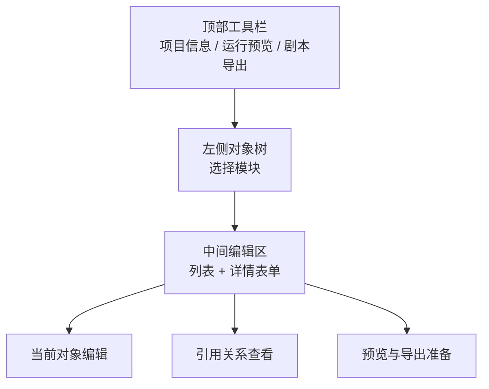
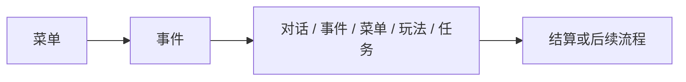
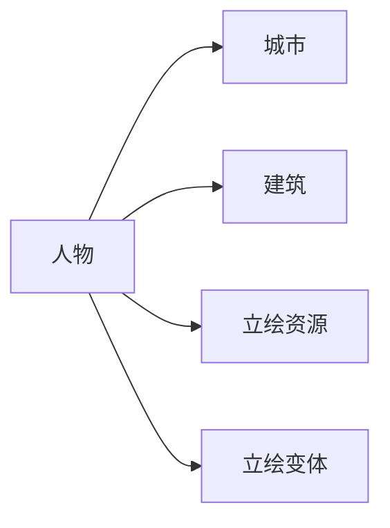
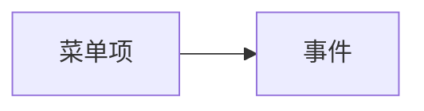
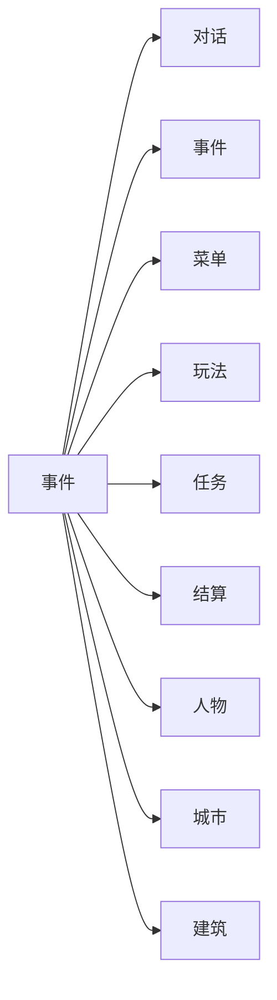
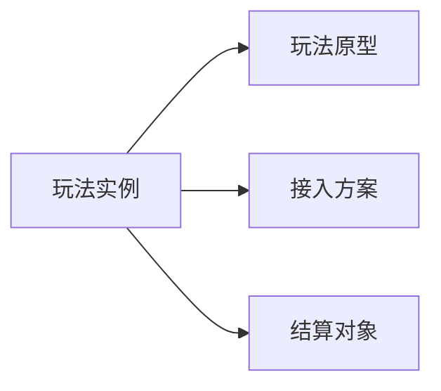
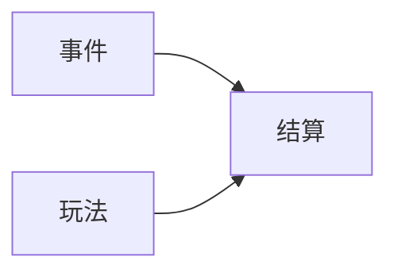

# 剧本编辑器功能说明

> 适用范围：`mod-first-dev` 分支当前可见的剧本编辑器工作台  
> 文档目标：作为剧本编辑器的正式功能说明书，详细解释当前版本的模块职责、字段用途、下拉项含义、引用关系与使用边界  
> 阅读建议：如果你想先学“怎么上手”，请先读 [剧本编辑器新手上手手册](./script-editor-beginner-handbook.md)。本文不是教学步骤，而是“这个编辑器到底提供了哪些功能”的说明书。

## 1. 这份文档讲什么，不讲什么

这份文档重点讲四件事：

1. 当前编辑器有哪些模块
2. 每个模块负责什么，不负责什么
3. 每个核心字段，尤其是下拉框，每一项分别代表什么
4. 模块与模块之间如何引用

这份文档**不负责**：

- 替代新手教程
- 讲源码实现
- 讲未来规划中的界面改造

因此，本文一律以**当前分支真实界面**为准。  
如果某个字段以后可能被删、被改名、被重新组织，但当前界面里它还存在，本文仍然按“当前可见功能”解释。

## 2. 编辑器整体定位

这套剧本编辑器不是技术表结构工具，而是面向创作者的中文内容工作台。

它当前最适合完成三类工作：

1. 建立内容对象  
   例如人物、城市、建筑、菜单、事件、玩法、结算。
2. 串联内容流程  
   例如菜单点击后进入哪条事件，事件之后进入对话还是玩法。
3. 进行运行前检查与交付  
   例如运行预览、导出剧本。

它当前**不适合**做的事：

1. 在编辑器里重新发明底层玩法机制
2. 把所有逻辑都塞进一个模块
3. 把创作工具当成底层工程字段编辑器

一句话概括：

> 这套编辑器负责组织剧本对象与内容流程，不负责替代底层玩法开发。

## 3. 入口与工作台结构

### 3.1 入口页

入口页当前提供这几种进入方式：

- `新建剧本`
- `打开草稿`
- `使用模板`
- `返回`

含义如下：

| 入口 | 作用 | 适合谁 |
| --- | --- | --- |
| `新建剧本` | 创建新的编辑器项目 | 已经明确知道要从零搭建的人 |
| `打开草稿` | 打开已有项目目录 | 继续已有项目的人 |
| `使用模板` | 导入内置模板项目 | 第一次使用、想先看样板的人 |
| `返回` | 回主菜单 | 暂时离开编辑器 |

### 3.2 工作台总布局

工作台分成三层：

1. 顶部工具栏
2. 左侧对象树
3. 中间编辑区

可用下面这张图理解：

### 3.3 顶部工具栏功能

当前顶栏最常用的是：

| 按钮 | 当前作用 |
| --- | --- |
| `返回列表` | 返回项目入口页 |
| `项目信息` | 查看和编辑项目级开局信息 |
| `运行预览` | 使用当前编辑器内数据启动临时可运行版本 |
| `剧本导出` | 导出当前项目为运行时剧本包 |

说明：

- 当前工具栏里不是所有内部能力都直接暴露为按钮。
- 例如 `保存`、`校验` 这类逻辑在当前界面组织方式里并不是顶栏主按钮。

## 4. 当前可见模块总览

当前左侧对象树可以看到的主要模块如下：

| 模块 | 主要职责 | 当前说明 |
| --- | --- | --- |
| 项目信息 | 设置项目级开局参数 | 当前默认打开 |
| 人物 | 管理角色档案与属性 | 当前完成度较高 |
| 城市 | 管理城市对象 | 可用 |
| 建筑 | 管理建筑对象 | 可用 |
| 对话 | 管理对话对象 | 可见 |
| 玩法 | 把预制玩法接入项目 | 可用，但仍有旧字段 |
| 结算 | 管理收尾结果对象 | 可用，模板默认无记录 |
| 事件 | 串联流程、承接跳转 | 当前最关键的流程模块 |
| 阶段配置 | 管理阶段/应用对象配置 | 可见 |
| 菜单 | 管理玩家可见入口 | 可用 |
| 立绘资源 | 管理人物立绘资源 | 可用 |
| 立绘变体 | 管理立绘变体 | 可用 |
| 文本 | 管理文本资源 | 可用 |

## 5. 模块之间的引用关系

这部分是理解编辑器最关键的结构说明。

### 5.1 当前最核心的一条链

在当前版本里，最常见的引用关系是：

- `菜单` 引用 `事件`
- `事件` 引用 `对话 / 事件 / 菜单 / 玩法 / 任务`
- `玩法` 可引用 `结算`
- `项目开局` 引用 `人物 / 城市 / 建筑`
- `人物` 引用 `城市 / 建筑 / 立绘资源 / 立绘变体`

### 5.2 当前各核心模块的主要引用方向

| 来源模块 | 可引用的目标 | 用途 |
| --- | --- | --- |
| 项目信息 | 人物、城市、建筑 | 决定开局默认位置与默认角色 |
| 人物 | 城市、建筑、立绘资源、立绘变体 | 决定角色归属与视觉表现 |
| 菜单 | 事件 | 决定玩家点击后进入哪条内容 |
| 事件 | 对话、事件、菜单、玩法、任务、结算 | 决定流程走向与收尾方式 |
| 玩法 | 玩法原型、接入方案、结算 | 决定调用哪种可玩内容以及如何收尾 |
| 结算 | 人物、城市、建筑等目标对象 | 决定最终结果落到谁身上 |

### 5.3 动态下拉与固定下拉

为了避免误解，先把所有下拉分成两类：

#### 固定下拉

由系统预先写死的选项，例如：

- `开局视图`
- `角色选择策略`
- `人物类型`
- `事件类型`
- `去向类型`
- `玩法原型`

#### 动态下拉

来自当前项目已存在对象，例如：

- `开局城市`
- `开局建筑`
- `默认角色`
- `所属城市`
- `所属建筑`
- `目标对象`
- `后续事件`
- `去向目标`
- `结算实例`

理解这个区分很重要：

> 固定下拉是在选“类别”；动态下拉是在选“当前项目里哪一个具体对象”。

## 6. 项目信息模块

项目级信息决定的是“剧本怎么开局”，不是单条剧情内容。

### 6.1 当前主要字段

当前可见字段包括：

- 项目标题
- 剧本包标题
- 开场场景标题
- 开局视图
- 开局城市
- 开局建筑
- 角色选择策略
- 默认角色
- 入口事件时机

### 6.2 字段逐项说明

#### `项目标题`

这是编辑器项目本身的标题。  
它主要用于创作者在项目列表和编辑器里识别当前项目。

#### `剧本包标题`

这是剧本包层级的标题。  
它更接近最终内容包的标题表达。

#### `开场场景标题`

用于描述这次开局对应的场景标题。  
可以理解为“这次故事开端叫什么”。

#### `开局视图`

这是一个**固定下拉**。

当前可选项：

| 选项 | 含义 | 适合场景 |
| --- | --- | --- |
| `地图` | 开局先进入地图层级 | 从大地图开始游玩 |
| `城市` | 开局直接进入某座城市 | 开局先落在城市场景 |
| `建筑` | 开局直接进入某个建筑 | 开局先落在某个室内或据点 |

它与 `开局城市`、`开局建筑` 有联动关系：

- 选 `地图` 时，通常更关注起始城市和地图落点
- 选 `城市` 时，`开局城市` 很关键
- 选 `建筑` 时，`开局建筑` 是决定性字段

#### `开局城市`

这是一个**动态下拉**，来源于当前项目 `城市` 模块中的全部城市对象。

它表示：

> 开局默认落在哪座城市。

如果当前项目没有某座城市，这里就不会出现对应选项。

#### `开局建筑`

这是一个**动态下拉**，来源于当前项目 `建筑` 模块中的全部建筑对象。

它表示：

> 开局默认落在哪个建筑。

#### `角色选择策略`

这是一个**固定下拉**。

当前可选项：

| 选项 | 含义 | 适合场景 |
| --- | --- | --- |
| `开局时选择角色` | 玩家进入游戏前先选角色 | 多主角、多开局人选的项目 |
| `使用默认角色直接开局` | 不弹角色选择，直接使用默认角色 | 单主角固定开局 |
| `使用第一个可操作角色开局` | 自动选当前项目里第一个可操作角色 | 需要快速进场、不想固定某一人时 |

#### `默认角色`

这是一个**动态下拉**，来源于当前项目 `人物` 模块里 `人物类型 = 角色` 的对象。

也就是说：

- `NPC` 不会进入这个下拉
- 只有被视为可操作角色的人物会出现

这个字段通常与 `角色选择策略` 配合理解：

- 如果策略是 `使用默认角色直接开局`，这个字段尤其重要
- 如果策略是 `开局时选择角色`，它更多是一个默认候选

#### `入口事件时机`

当前界面中这是一个文本字段，不是下拉。  
它用于描述项目进入后何时触发入口事件。

在模板项目中你会看到类似：

- `after-map-entry`

对创作者来说，它更像“开局入口触发时机”的标记字段。

## 7. 人物模块

人物模块当前主要承担：

- 建立角色档案
- 维护角色归属
- 绑定立绘
- 维护人物自定义属性

### 7.1 当前主要 tab

当前人物详情页主要有：

- `基础`
- `属性组`

其中：

- `基础` 是创作者最常用的主表单
- `属性组` 更适合整理人物属性结构

### 7.2 `基础` 页字段说明

#### `人物名称`

创作者看到与玩家最终可能看到的人物名称。

#### `人物类型`

这是一个**固定下拉**。

当前可选项：

| 选项 | 含义 |
| --- | --- |
| `角色` | 可作为玩家操作角色的对象 |
| `NPC` | 普通非玩家角色 |

它会影响其他模块里的引用表现，最明显的是：

- `默认角色` 下拉只会收录 `角色`

#### `正式身份`

用于描述角色正式身份，例如职务、爵位、社会身份。

#### `职业/定位`

用于描述角色在内容中的功能定位，例如护卫、掌柜、住持、谋士等。

#### `所属城市`

这是一个**动态下拉**，来源于当前项目 `城市` 模块全部城市对象。

它表示：

> 这个人物当前归属于哪座城市。

#### `所属建筑`

这是一个**动态下拉**，来源于当前项目 `建筑` 模块，但会优先按当前 `所属城市` 过滤。

含义：

> 这个人物当前归属于哪座建筑。

引用关系：

- `人物 -> 建筑`
- 该建筑通常也应逻辑上属于当前所选城市

#### `人物立绘`

这是一个**动态下拉**，来源于两类对象混合结果：

1. `立绘资源`
2. `立绘变体`

因此你在下拉里看到的选项，可能既有：

- 某个完整立绘资源名
- 某个立绘资源下的变体名

这也是当前项目里“看起来像重复选项”的一个主要来源。

它背后的实际引用关系是：

- 选立绘资源：`人物 -> 立绘资源`
- 选立绘变体：`人物 -> 立绘变体`，同时会自动带上其父立绘资源

#### `人物简介`

用于填写角色说明、人物简介、创作备注。

#### `自定义属性`

这不是一个单独下拉，而是一组可增删属性项。  
创作者可以为角色维护附加属性，例如：

- 出生年
- 年龄
- 所属
- 统率
- 武勇

### 7.3 人物模块的主要引用关系

## 8. 菜单模块

菜单模块当前负责：

- 创建玩家可见菜单项
- 给菜单项命名
- 指定点击后进入的目标对象

### 8.1 当前主要字段

当前主编辑区中最核心的字段只有两个：

- `菜单名称`
- `目标对象`

这正体现了菜单模块的边界：

> 菜单模块主要负责入口展示与入口指向，不负责承载完整业务流程。

### 8.2 `菜单名称`

玩家看到的按钮文本。

### 8.3 `目标对象`

这是一个**动态下拉**。  
当前版本里，菜单模块的 `目标对象` 主要来自：

- `事件` 模块

也就是说，菜单当前最主要的作用是：

> 把一个按钮入口指向某条事件。

如果你看到下拉里的内容像：

- `皇觉寺剃度`
- `皇觉寺首轮评定`
- `住持准其外出化缘`
- `化缘`

它们本质上都是当前项目里可被菜单指向的事件记录。

### 8.4 菜单模块的引用关系

这是当前版本里非常重要的约束：

- 菜单不是直接指向玩法原型
- 菜单不是直接发奖励
- 菜单主要通过事件承接后续逻辑

## 9. 事件模块

事件模块是当前编辑器最关键的流程调度层。

### 9.1 当前主要字段

核心字段包括：

- `事件标题`
- `事件类型`
- `允许重复触发`
- `事件说明`
- `后续事件`
- `结算模块`（仅某些事件类型出现）
- `去向类型`
- `去向目标`
- `所属剧情 ID`
- `关联人物`
- `关联城市`
- `关联建筑`

### 9.2 `事件类型`

这是一个**固定下拉**。

当前可选项：

| 选项 | 含义 |
| --- | --- |
| `普通事件` | 默认事件类型，用于一般流程承接 |
| `结算` | 这条事件本身以结算为核心 |
| `菜单` | 这条事件与菜单类跳转有关 |

引用影响：

- 当你把 `事件类型` 设为 `结算` 时，会额外出现 `结算模块` 下拉

### 9.3 `后续事件`

这是一个**动态下拉**，来源于当前项目 `事件` 模块里的全部事件对象，但会排除当前事件本身。

它表示：

> 当前事件完成后，是否还要继续接下一条事件。

特殊项：

| 选项 | 含义 |
| --- | --- |
| `空表示直接关闭` | 当前事件执行完后，不再自动继续后续事件 |

### 9.4 `结算模块`

这个字段只会在 `事件类型 = 结算` 时出现。

它是一个**动态下拉**，来源于当前项目 `结算` 模块里的全部结算对象。

它表示：

> 这条事件要调用哪一个结算对象完成结果收尾。

### 9.5 `去向类型`

这是一个**固定下拉**。

当前可选项：

| 选项 | 含义 |
| --- | --- |
| `对话` | 事件后进入对话对象 |
| `事件` | 事件后继续进入另一条事件 |
| `菜单` | 事件后进入某个菜单类落点 |
| `玩法` | 事件后进入玩法对象 |
| `任务` | 事件后进入任务对象 |

说明：

- 当前界面里会显示这些类型
- 但并不是每一种去向都已经同样成熟地接入运行预览

当前版本提示上明确说明：

- 某些去向类型暂未接入运行预览

### 9.6 `去向目标`

这是一个**动态下拉**，它的来源取决于 `去向类型`。

对应关系如下：

| 去向类型 | 去向目标来源 |
| --- | --- |
| `对话` | 对话模块中的对象 |
| `事件` | 事件模块中的对象 |
| `菜单` | 菜单用途目标列表 |
| `玩法` | 玩法模块中的对象 |
| `任务` | 任务模块中的对象 |

也就是说，`去向目标` 不是固定一套列表，而是**联动下拉**。

### 9.7 `所属剧情 ID`

用于把当前事件挂到某个剧情节点或剧情线索下。

### 9.8 `关联人物 / 关联城市 / 关联建筑`

这三组字段用于说明当前事件与哪些对象有关。

它们不是“去向”，而是“关联”。

区别非常重要：

- `去向` 决定流程往哪走
- `关联` 决定这条内容和谁相关

### 9.9 事件模块的引用关系

## 10. 玩法模块

玩法模块当前承担的是：

- 建立项目内玩法实例
- 选择玩法原型
- 选择接入方式
- 选择结算实例

请特别注意：

> 当前界面虽然未来可能调整，但在当前分支里，玩法页仍然以 `绑定标题 / 玩法原型 / 接入方案 / 结算实例` 这套结构呈现。

### 10.1 `绑定标题`

这是这条玩法实例在当前项目里的名字。

### 10.2 `玩法原型`

这是一个**固定下拉**。

当前可选项：

| 选项 | 含义 |
| --- | --- |
| `互动问答` | 问答/QTE 类型玩法 |
| `城市乞讨` | 城市乞讨玩法 |
| `粮账核算` | 粮铺账目核算玩法 |
| `药材炼制` | 药铺炼药玩法 |
| `剧情战斗` | 剧情战斗玩法 |
| `建筑流程` | 建筑流程类玩法 |

这一步决定的是：

> 当前这条玩法实例，底层调用的是哪一种玩法能力。

### 10.3 `接入方案`

这是一个**动态下拉**，但它并不是来自创作者手工建的内容对象，而是来自系统内置的玩法接入方案列表，并且会随 `玩法原型` 变化而过滤。

当前能看到的典型选项包括：

| 选项 | 含义 |
| --- | --- |
| `城市乞讨 / 外部入口` | 从外部入口启动城市乞讨 |
| `互动问答 / 对话接入` | 从对话流程启动互动问答 |
| `互动问答 / 寺庙接入` | 从寺庙玩法入口启动互动问答 |
| `粮账核算 / 粮铺接入` | 从粮铺场景启动粮账核算 |
| `药材炼制 / 药铺接入` | 从药铺场景启动药材炼制 |
| `剧情战斗 / 对话接入` | 从对话流程进入剧情战斗 |
| `建筑流程 / 建筑接入` | 从建筑入口进入建筑流程玩法 |

理解方法：

- `玩法原型` 决定“玩什么”
- `接入方案` 决定“从哪里、按什么方式进入这个玩法”

### 10.4 `结算实例`

这是一个**动态下拉**，来源于当前项目 `结算` 模块。

特殊项：

| 选项 | 含义 |
| --- | --- |
| `不绑定` | 当前玩法实例不直接关联结算对象 |

其他项则表示：

> 当前玩法实例结束后，可以把结果交给该结算对象处理。

### 10.5 玩法模块的引用关系

## 11. 结算模块

结算模块当前用于承接：

- 奖励
- 扣除
- 状态变化
- 结果收尾

### 11.1 当前模板状态

在当前模板项目中，结算列表默认是空的。  
这表示：

- 结算模块本身存在
- 但模板没有预先给你填好结算对象

### 11.2 它与其他模块的关系

当前最常见的两种引用方式是：

- `事件类型 = 结算` 时，事件引用结算对象
- 玩法中的 `结算实例` 引用结算对象

## 12. 当前版本最重要的引用规则总结

如果你只想记住最关键的引用关系，请记这张表：

| 模块 | 最关键引用 |
| --- | --- |
| 项目信息 | 人物、城市、建筑 |
| 人物 | 城市、建筑、立绘资源、立绘变体 |
| 菜单 | 事件 |
| 事件 | 对话、事件、菜单、玩法、任务、结算 |
| 玩法 | 玩法原型、接入方案、结算 |
| 结算 | 作为事件或玩法的结果收尾目标 |

## 13. 当前版本的说明边界

为了避免把“未来规划”和“当前界面”混在一起，这里单独强调：

### 13.1 玩法页仍保留旧式字段

当前功能说明书中仍解释：

- `接入方案`
- `结算实例`

这是因为它们在当前界面中仍然存在。

### 13.2 菜单页顶部概述区仍存在

当前菜单页上方仍有概述信息带。  
它属于当前工作台现状，不是菜单创作的主表单内容。

### 13.3 结算模块默认空白

当前模板没有给出预置结算对象，因此功能存在，但示例数据为空。

## 14. 一句话总括

如果把当前剧本编辑器功能说明压缩成一句话：

> 这是一套通过“对象模块建内容、菜单给入口、事件做承接、玩法做可玩内容、结算做收尾结果”的创作型剧本工作台。
