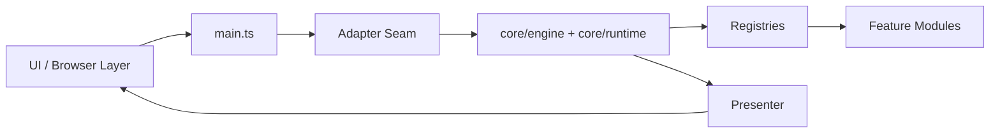
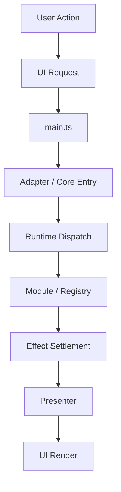
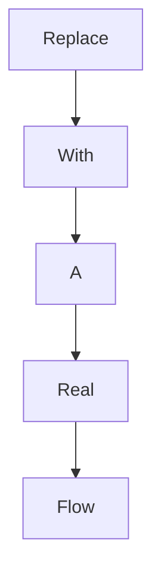

# Weekly Architecture Report

> **Historical Template:** Deprecated under `fail-closed progress-driven governance`. Keep only for historical weekly reports.

**Week Of:** `YYYY-MM-DD`

## Purpose

This report is the weekly structure snapshot.

It must show:

- the current functional module graph
- the current control-flow picture
- which parts are official modules
- which parts are still adapters or temporary seams

## Architecture Summary

- Replace with a short summary of what the architecture looks like at the end of the week.

## Current Queue State

- Weekly queue status: `Replace with open / closed / review-prep / similar explicit state.`
- Active executable child: `Replace with the current child id or none.`
- Locked follow-up child: `Replace with the current locked follow-up or none.`
- Planning rule: `Replace with whether later candidate work is only architectural context or an unlocked executable child.`

## Runtime Maturity Snapshot

| Runtime / Boundary | Current Maturity | Current Production Role | Remaining Debt | Candidate Follow-Up |
| --- | --- | --- | --- | --- |
| `Runtime name` | `formal-owner / owner-first-slice / partial-owner / bridge / adapter-only` | `what it owns today` | `what still remains mixed or deferred` | `candidate next split or none` |

## Module Diagram

## Official Modules

- Replace with the modules that are now treated as stable.

## Temporary Adapters

- Replace with temporary seams still required.

## Flow Diagram 1: Replace With Real Flow Name

## Flow Diagram 2: Replace With Real Flow Name

## Architecture Delta This Week

- Replace with what changed relative to last week.

## Architecture Risks

- Replace with the parts still acting like black boxes.

## Candidate Post-Queue Splits

These are architecture candidates only. They are not unlocked children and must not be executed without a fresh weekly review plus new spec/plan authoring.

1. `Replace with candidate split`
   - Primary target:
     - `...`
   - Reason to split independently:
     - `...`
   - Do not mix with:
     - `...`
