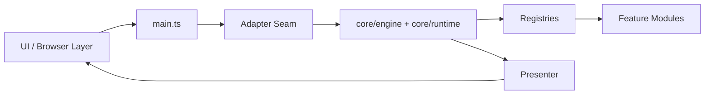
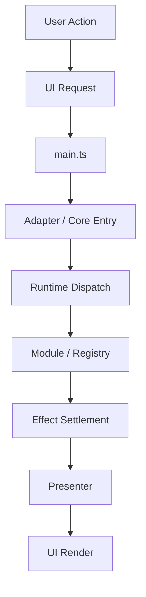
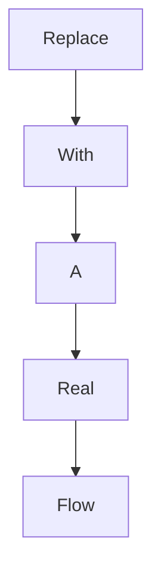

# Weekly Architecture Report

**Week Of:** `YYYY-MM-DD`

## Purpose

This report is the weekly structure snapshot.

It must show:

- the current functional module graph
- the current control-flow picture
- which parts are official modules
- which parts are still adapters or temporary seams

## Architecture Summary

- Replace with a short summary of what the architecture looks like at the end of the week.

## Module Diagram

## Official Modules

- Replace with the modules that are now treated as stable.

## Temporary Adapters

- Replace with temporary seams still required.

## Flow Diagram 1: Replace With Real Flow Name

## Flow Diagram 2: Replace With Real Flow Name

## Architecture Delta This Week

- Replace with what changed relative to last week.

## Architecture Risks

- Replace with the parts still acting like black boxes.
