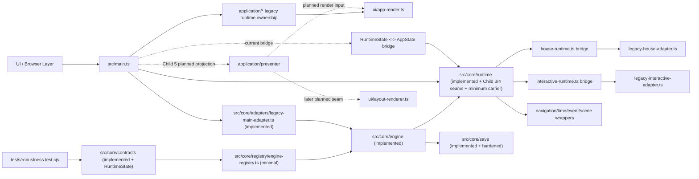
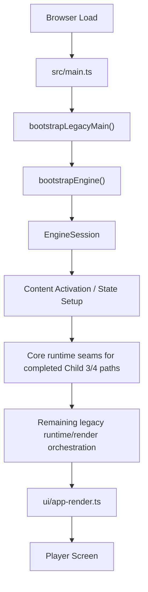
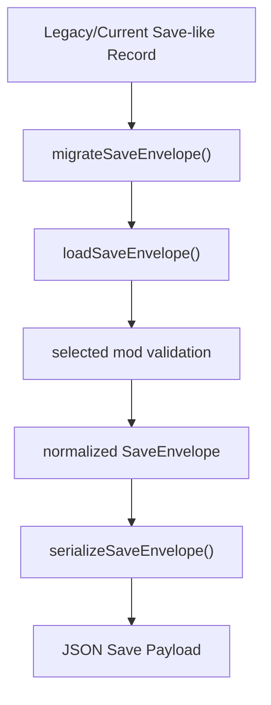
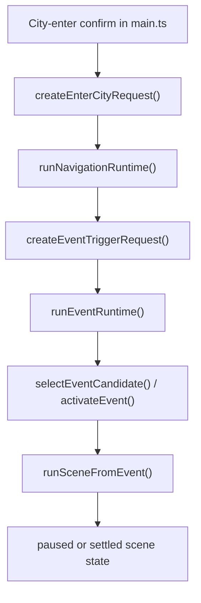
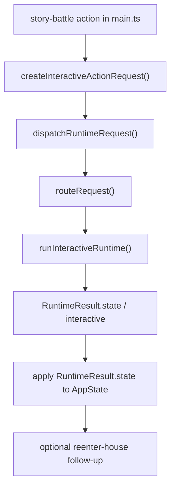

# Weekly Architecture Report

**Week Of:** `2026-06-29`

## Purpose

This report is the weekly structure snapshot.

It must show:

- the current functional module graph
- the current control-flow picture
- which parts are official modules
- which parts are still adapters or temporary seams

## Architecture Summary

- This week established the first production-safe `src/core` boundary, hardened its persistence layer, moved the first real navigation/time/event entry paths behind `src/core/runtime`, then advanced Child 4 through both its first interactive bridge slice and its second minimum RuntimeState/shared-dispatch slice.
- The current production runtime is still centered on `src/main.ts`, but `src/core/contracts`, `src/core/engine`, `src/core/runtime`, `src/core/save`, `src/core/adapters/legacy-main-adapter.ts`, `src/core/adapters/legacy-house-adapter.ts`, and `src/core/adapters/legacy-interactive-adapter.ts` now exist as concrete boundary slices with read/write persistence plus first-pass navigation and covered interactive entry plus minimum shared-dispatch return behavior.
- The immediate next target is Child 5 presenter/render decoupling: Child 4 has completed on the landed minimum carrier, so the next planned reduction is presenter-output and `app-render` ownership without reopening the `characterDefinitions` convergence decision.

## Module Diagram

## Implemented Official Modules

- Plan governance documents under `docs/superpowers/plans/`
- Weekly orchestration and weekly visibility companion roles
- `src/core/contracts/*` as the first real production boundary slice
- `src/core/engine/*` as the first real selected-mod bootstrap slice
- `src/core/runtime/*` as the first real runtime-owned transition slice
- `src/core/save/*` as the first real persistence boundary slice with migration, validation, and writer ownership
- `src/core/adapters/legacy-main-adapter.ts` as the first production `main.ts -> core` handoff seam
- `src/core/contracts/interactive-runtime.ts`, `src/core/contracts/runtime-state.ts`, `src/core/runtime/interactive-runtime.ts`, and `src/core/runtime/house-runtime.ts` as the first production interactive-runtime and minimum RuntimeState carrier slices
- `src/core/adapters/legacy-house-adapter.ts` and `src/core/adapters/legacy-interactive-adapter.ts` as transitional compatibility seams for Child 4

## Approved Target Modules

- The intended `src/core` directory ownership model at the design/spec level
- Child 3 navigation/time/event extraction behind the new core runtime boundary
- Child 4 interactive runtime integration after Child 3, completed on the approved minimum RuntimeState carrier
- Child 5 presenter/layout extraction, now unlocked as the next legal queue item

## Temporary Adapters

- `src/core/adapters/legacy-main-adapter.ts` is now implemented as a temporary bridge
- `src/core/adapters/legacy-house-adapter.ts` and `src/core/adapters/legacy-interactive-adapter.ts` are now implemented as temporary bridges
- Legacy interactive gameplay logic still lives behind those adapters
- Child 6 `Task Runtime`, Child 7 `Mod Runtime`, and Child 8 `StateSync Runtime` now exist as formal queued architecture slices, but none is the current executable queue item while Child 5 remains next.

## Flow Diagram 1: Current Boot And Render Flow

## Flow Diagram 2: Real Child 2 Save Migration Boundary

## Flow Diagram 3: Real Child 3 Navigation To Scene Handoff

## Flow Diagram 4: Real Child 4 Minimum RuntimeState Reentry

## Architecture Delta This Week

- Added a formal parent plan, child boundary plan, weekly orchestration plan, and visibility companion relationship.
- Established a weekly artifact bundle for module maps, call flows, split review, architecture diagrams, and review/change-impact summaries.
- Simplified weekly visibility governance from eight independent artifacts to five core artifacts.
- Clarified that `src/core` is the official target root for engine/runtime extraction.
- Landed the first production `src/core/contracts/*` files and the first minimal `EngineRegistry` type.
- Discovered and fixed a real integration seam in `tsconfig.test.json` so test builds include the new `src/core` source root.
- Landed `src/core/engine/*` and upgraded registry typing so selected-mod boot composition is now real.
- Moved active execution into an isolated worktree to avoid shared-file collisions during later Child 1 tasks.
- Landed `src/core/runtime/*` so routed effects now settle back into core-owned state.
- Landed `src/core/save/save-envelope.ts` so selected mod identity plus mod state now have a minimal persistence seam.
- Landed `src/core/adapters/legacy-main-adapter.ts` and routed `src/main.ts` through it.
- Landed `src/core/save/save-migrations.ts`, `save-loader.ts`, and `save-writer.ts` so persistence now owns migration, validation, and round-trip serialization under `src/core`.
- Landed `src/core/runtime/navigation-runtime.ts`, `time-runtime.ts`, `event-runtime.ts`, `scene-runtime.ts`, and related seam files so navigation/time/event entry now flows through the first real runtime wrappers under `src/core`.
- Routed real city-entry, timed advancement, and trigger-driven event entry paths in `src/main.ts` through Child 3 runtime seams instead of keeping those paths fully inline.
- Landed `src/core/contracts/interactive-runtime.ts`, `src/core/runtime/interactive-runtime.ts`, `src/core/runtime/house-runtime.ts`, `src/core/adapters/legacy-house-adapter.ts`, and `src/core/adapters/legacy-interactive-adapter.ts`.
- Routed covered city-begging, activity-qte, and story-battle launch/action entry in `src/main.ts` through the new Child 4 runtime seams instead of direct application-house construction and direct helper imports.
- Landed `src/core/contracts/runtime-state.ts` and widened `src/core/contracts/runtime-result.ts`, `src/core/runtime/runtime-router.ts`, `src/core/runtime/runtime-dispatch.ts`, and `src/core/runtime/runtime-settlement.ts` to the minimum RuntimeState carrier.
- Updated `src/core/runtime/interactive-runtime.ts` and `src/main.ts` so at least one covered interactive path now returns through shared dispatch on the minimum carrier while `characterDefinitions` remains on additive compatibility carriage.

## Architecture Risks

- `src/main.ts` is still the dominant production black box.
- `src/core` is only partially implemented, so the current architecture remains largely legacy-owned above the new boundary.
- The new contracts, engine seam, runtime seam, save seam, and adapter seams are still intentionally narrow even though persistence is hardened, Child 3 entry seams are validated, and Child 4 bridge seams now cover selected interactive flows.
- Child 4 has already widened the shared `runtime-router.ts` / `runtime-dispatch.ts` contract to `RuntimeState`, but runtime ownership is still split between common dispatch and dedicated bridge helpers across the remaining interactive surface.
- `characterDefinitions` is intentionally not part of `RuntimeState.core` in the current landing, so future convergence is still gated by weekly promotion rules rather than implied by the new carrier.
- Presenter and layout seams are still conceptual until later child plans land.
