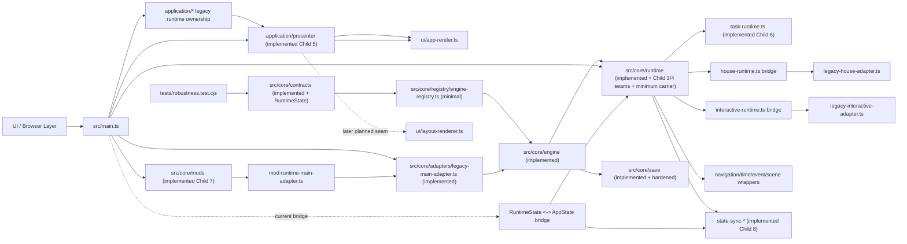
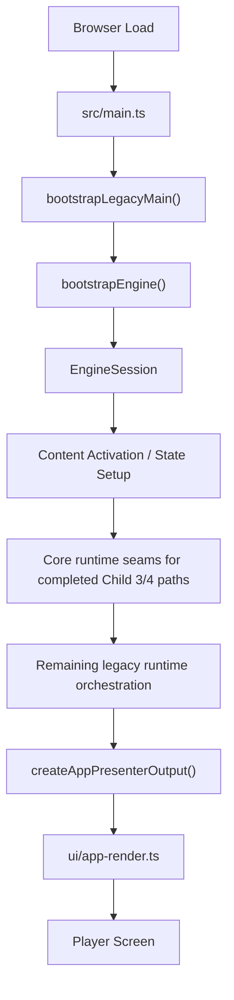
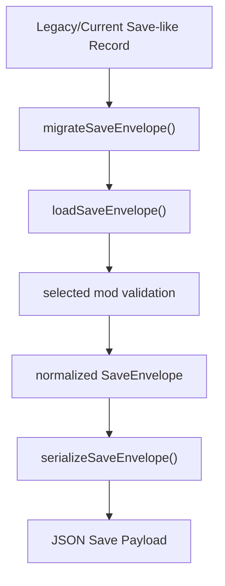
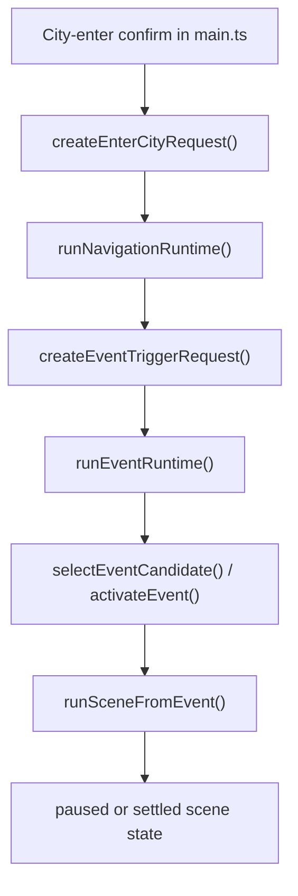
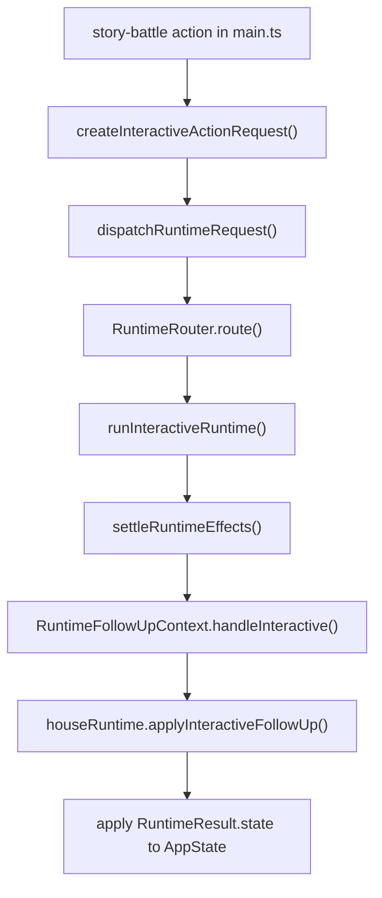
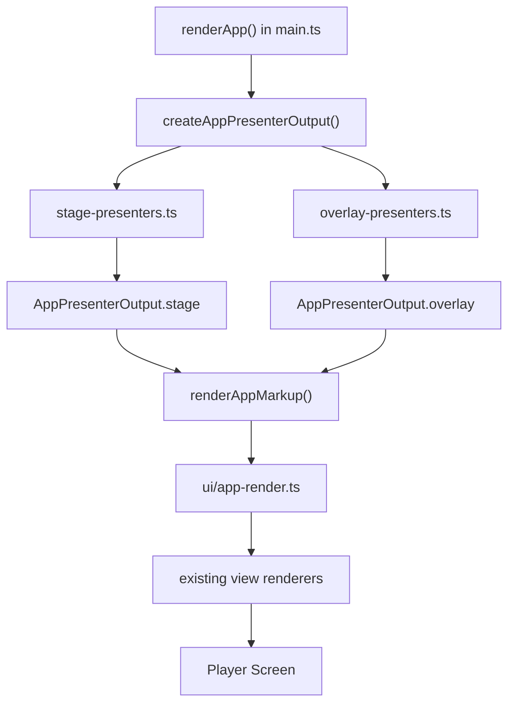
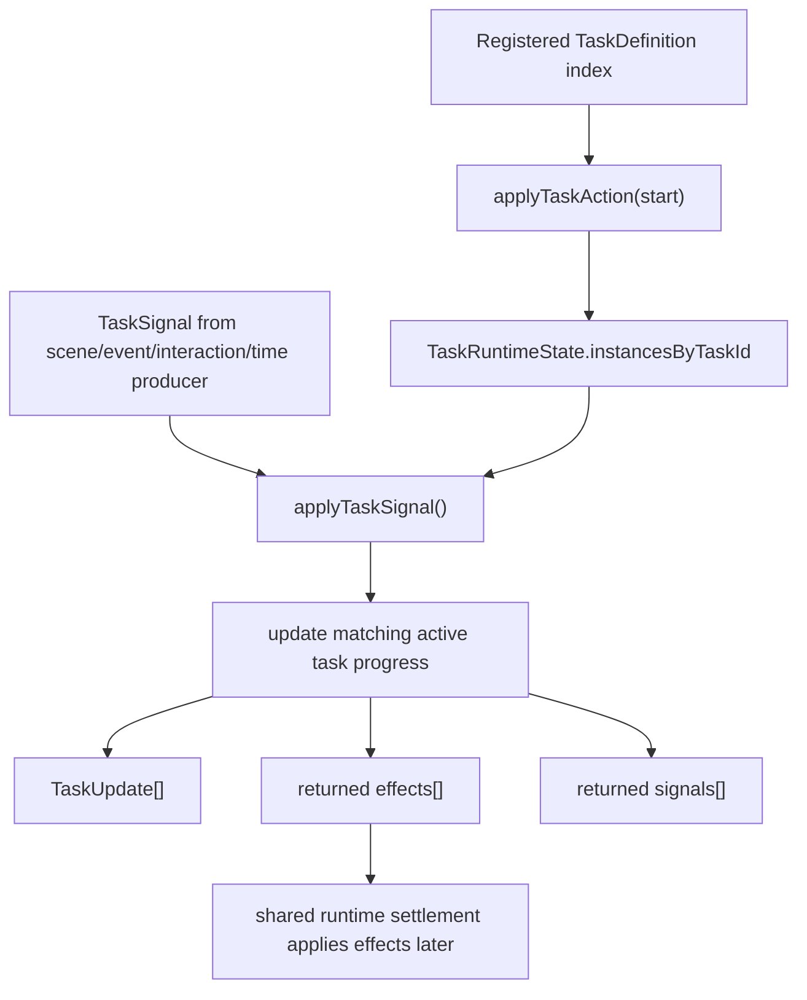
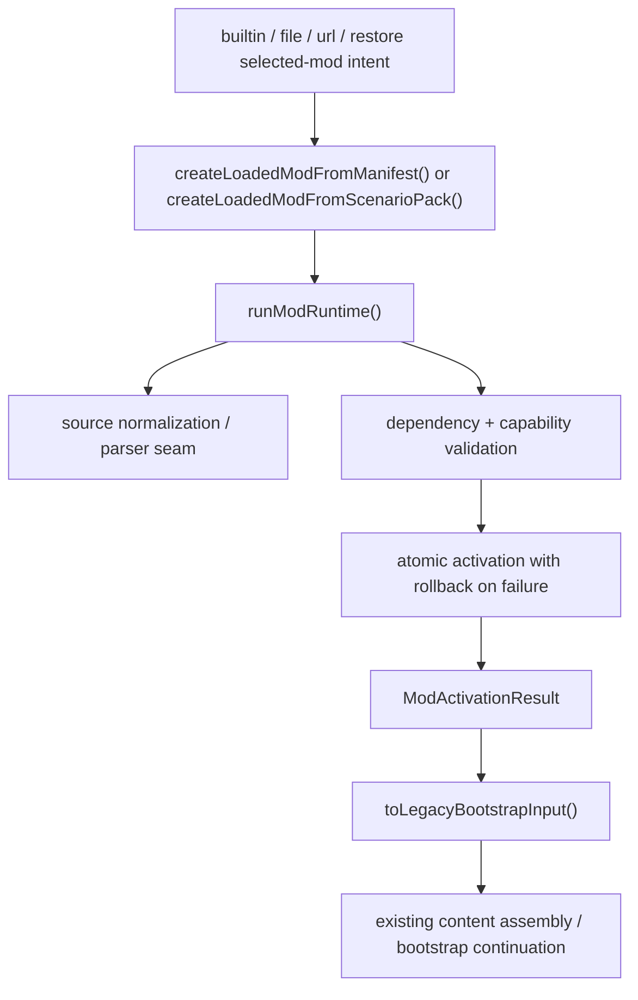
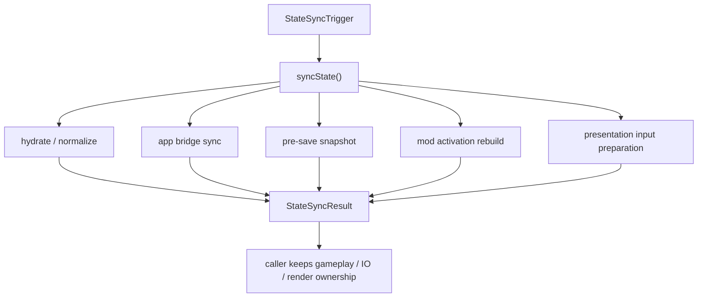

# Weekly Architecture Report

**Week Of:** `2026-06-29`

## Purpose

This report is the weekly structure snapshot.

It must show:

- the current functional module graph
- the current control-flow picture
- which parts are official modules
- which parts are still adapters or temporary seams

## Architecture Summary

- This week established the first production-safe `src/core` boundary, hardened its persistence layer, moved the first real navigation/time/event entry paths behind `src/core/runtime`, advanced Child 4 through interactive/runtime carrier slices, completed Child 5 presenter/render decoupling, completed Child 6 Task Runtime, completed Child 7 Mod Runtime, and completed Child 8 StateSync Runtime.
- The current production runtime is still centered on `src/main.ts`, but `src/core/contracts`, `src/core/engine`, `src/core/runtime`, `src/core/save`, `src/core/adapters/*`, `src/core/mods/*`, `src/core/runtime/state-sync-*`, `src/application/presenter`, and `src/core/runtime/task-runtime.ts` now exist as concrete boundary slices with read/write persistence, first-pass navigation, covered interactive entry, minimum shared-dispatch return behavior, presenter-output render selection, formal task lifecycle/progression ownership, formal mod activation/startup ownership, and formal state synchronization ownership.
- Child 9 Runtime Contract Hardening is now completed on all four approved shared contract baselines.
- Child 10 Runtime Ownerization Review And Baseline is now completed as the formal post-Child-9 review gate and controlling baseline artifact.
- Child 11 Sub-Runtime Ownerization Implementation is now completed: Task 1 landed the minimum shared-dispatch follow-up convergence for the covered story-battle reentry path, Task 2 landed covered interactive ownerization for the city-begging path, Task 3 landed covered house ownerization for the grain-shop path, and Task 4 aligned the covered advanceTime settlement path before closeout.
- Child 12 UI Contract Reserve is now completed on the additive UI reserve landing, and Child 13 is now completed on the remaining same-type shared-dispatch reentry closeout with no Bucket B/C remainder in the in-scope audit.

## Module Diagram

## Implemented Official Modules

- Plan governance documents under `docs/superpowers/plans/`
- Weekly orchestration and weekly visibility companion roles
- `src/core/contracts/*` as the first real production boundary slice
- `src/core/engine/*` as the first real selected-mod bootstrap slice
- `src/core/runtime/*` as the first real runtime-owned transition slice
- `src/core/save/*` as the first real persistence boundary slice with migration, validation, and writer ownership
- `src/core/adapters/legacy-main-adapter.ts` as the first production `main.ts -> core` handoff seam
- `src/core/contracts/interactive-runtime.ts`, `src/core/contracts/runtime-state.ts`, `src/core/runtime/interactive-runtime.ts`, and `src/core/runtime/house-runtime.ts` as the first production interactive-runtime and minimum RuntimeState carrier slices
- `src/core/adapters/legacy-house-adapter.ts` and `src/core/adapters/legacy-interactive-adapter.ts` as transitional compatibility seams for Child 4
- `src/application/presenter/*` as the first production presentation bridge slice for presenter output, stage selection, overlay/HUD projection, and render-time house/city/scene selection
- `src/core/contracts/task-runtime.ts` and `src/core/runtime/task-runtime.ts` as the first production Task Runtime slice for task contracts, lifecycle, action handling, signal-driven progression, and task runtime result output
- `src/core/contracts/mod-runtime.ts`, `src/core/mods/*`, and `src/core/adapters/mod-runtime-main-adapter.ts` as the first production Mod Runtime slice for source normalization/loading/parsing, dependency/capability validation, atomic activation, typed failures, and unified activation handoff
- `src/core/contracts/state-sync-runtime.ts` and `src/core/runtime/state-sync-*` as the first production StateSync Runtime slice for canonical runtime state, app bridge, save snapshot, presentation input, mandatory triggers, syncState, and bridge-period helper migration

## Approved Target Modules

- The intended `src/core` directory ownership model at the design/spec level
- Child 3 navigation/time/event extraction behind the new core runtime boundary
- Child 4 interactive runtime integration after Child 3, completed on the approved minimum RuntimeState carrier
- Child 5 presenter/render extraction, completed on the first presenter-output bridge
- Child 6 Task Runtime extraction, completed on the first formal contract/lifecycle/progression slice
- Child 7 Mod Runtime extraction, completed on the first activation/startup seam
- Child 8 StateSync Runtime extraction, completed on the first formal canonical boundary slice
- Child 9 Runtime Contract Hardening, now completed as the shared contract-hardening baseline before later ownerization
- Child 10 Runtime Ownerization Review And Baseline, now completed as the required pre-implementation review/baseline child after Child 9
- Child 11 Sub-Runtime Ownerization Implementation, now the completed follow-up ownerization child for the approved covered runtime slices
- Child 12 UI Contract Reserve, now completed on the additive UI layout/interface-reserve landing after Child 11
- Child 13 Post-Child-11 Shared Dispatch Follow-Up / Reentry Convergence Audit, now the completed runtime continuation closeout child after Child 12

## Temporary Adapters

- `src/core/adapters/legacy-main-adapter.ts` is now implemented as a temporary bridge
- `src/core/adapters/legacy-house-adapter.ts` and `src/core/adapters/legacy-interactive-adapter.ts` are now implemented as temporary bridges
- Legacy interactive gameplay logic still lives behind those adapters
- Child 9 is now closed, and those adapters intentionally remain in place after Child 9 because ownerization is deferred.
- Child 10 has now finalized which adapters are retained through Child 11 and which are targeted for removal inside Child 11.
- Child 11 was the first executable child allowed to remove or narrow the interactive/house adapters; Task 1 narrowed shared follow-up ownership, Task 2 narrowed the interactive adapter by removing the covered city-begging lifecycle wrappers, Task 3 reduced the house adapter to a compatibility placeholder for the covered grain-shop lifecycle, and Task 4 aligned the covered advanceTime settlement path under runtime-settlement.ts.

## Flow Diagram 1: Current Boot And Render Flow

## Flow Diagram 2: Real Child 2 Save Migration Boundary

## Flow Diagram 3: Real Child 3 Navigation To Scene Handoff

## Flow Diagram 4: Real Child 11 Task 1 Shared Dispatch Reentry Follow-Up

## Flow Diagram 5: Real Child 5 Presenter Output Render Path

## Flow Diagram 6: Real Child 6 Task Signal Progression

## Flow Diagram 7: Real Child 7 Mod Runtime Activation Handoff

## Flow Diagram 8: Real Child 8 StateSync Runtime Boundary

## Architecture Delta This Week

- Added a formal parent plan, child boundary plan, weekly orchestration plan, and visibility companion relationship.
- Established a weekly artifact bundle for module maps, call flows, split review, architecture diagrams, and review/change-impact summaries.
- Simplified weekly visibility governance from eight independent artifacts to five core artifacts.
- Clarified that `src/core` is the official target root for engine/runtime extraction.
- Landed the first production `src/core/contracts/*` files and the first minimal `EngineRegistry` type.
- Discovered and fixed a real integration seam in `tsconfig.test.json` so test builds include the new `src/core` source root.
- Landed `src/core/engine/*` and upgraded registry typing so selected-mod boot composition is now real.
- Moved active execution into an isolated worktree to avoid shared-file collisions during later Child 1 tasks.
- Landed `src/core/runtime/*` so routed effects now settle back into core-owned state.
- Landed `src/core/save/save-envelope.ts` so selected mod identity plus mod state now have a minimal persistence seam.
- Landed `src/core/adapters/legacy-main-adapter.ts` and routed `src/main.ts` through it.
- Landed `src/core/save/save-migrations.ts`, `save-loader.ts`, and `save-writer.ts` so persistence now owns migration, validation, and round-trip serialization under `src/core`.
- Landed `src/core/runtime/navigation-runtime.ts`, `time-runtime.ts`, `event-runtime.ts`, `scene-runtime.ts`, and related seam files so navigation/time/event entry now flows through the first real runtime wrappers under `src/core`.
- Routed real city-entry, timed advancement, and trigger-driven event entry paths in `src/main.ts` through Child 3 runtime seams instead of keeping those paths fully inline.
- Landed `src/core/contracts/interactive-runtime.ts`, `src/core/runtime/interactive-runtime.ts`, `src/core/runtime/house-runtime.ts`, `src/core/adapters/legacy-house-adapter.ts`, and `src/core/adapters/legacy-interactive-adapter.ts`.
- Routed covered city-begging, activity-qte, and story-battle launch/action entry in `src/main.ts` through the new Child 4 runtime seams instead of direct application-house construction and direct helper imports.
- Landed `src/core/contracts/runtime-state.ts` and widened `src/core/contracts/runtime-result.ts`, `src/core/runtime/runtime-router.ts`, `src/core/runtime/runtime-dispatch.ts`, and `src/core/runtime/runtime-settlement.ts` to the minimum RuntimeState carrier.
- Updated `src/core/runtime/interactive-runtime.ts` and `src/main.ts` so at least one covered interactive path now returns through shared dispatch on the minimum carrier while `characterDefinitions` remains on additive compatibility carriage.
- Landed `src/application/presenter/presenter-output.ts`, `app-presenter.ts`, `stage-presenters.ts`, and `overlay-presenters.ts` so presentation projection has a production seam.
- Updated `src/main.ts` to call `createAppPresenterOutput()` before rendering.
- Updated `src/ui/app-render.ts` so stage/overlay/HUD render decisions consume presenter output and no longer import gameplay selection helpers directly.
- Landed `src/core/contracts/task-runtime.ts` and `src/core/runtime/task-runtime.ts` so Task Runtime owns minimum task lifecycle and signal-driven progression without absorbing effect settlement, event activation, scene sessions, interaction sessions, time advancement, save/load IO, or presentation.
- Landed `src/core/contracts/mod-runtime.ts`, `src/core/mods/mod-source-registry.ts`, `mod-source-loader.ts`, `mod-parser.ts`, `mod-dependency-resolver.ts`, `mod-capability-guard.ts`, `mod-runtime.ts`, and `src/core/adapters/mod-runtime-main-adapter.ts` so Mod Runtime owns source normalization/loading/parsing, typed activation requests/results/failures, dependency/capability validation, atomic activation rollback, and unified startup handoff without absorbing content assembly, save/load IO, gameplay runtimes, UI, or presenter work.
- Updated `src/main.ts` so builtin, file-imported, url-imported, and restore-time selected-mod activation calls pass through Mod Runtime before existing content assembly and bootstrap continuation.
- Landed `src/core/contracts/state-sync-runtime.ts` plus `src/core/runtime/state-sync-*` so StateSync Runtime owns canonical runtime state, app bridge, save snapshot, presentation input, mandatory triggers, syncState, validation, normalization, hydration, pre-save preparation, mod rebuild, and presentation input preparation without absorbing gameplay dispatch, save IO, Mod Runtime activation, or rendering.
- Moved bridge-period interactive RuntimeState creation/write-back helpers out of `src/main.ts` and behind the StateSync runtime boundary.
- Finalized the Child 10 runtime ownerization baseline so owner vs bridge maturity, adapter disposition, main.ts coupling, and Child 11 execution controls are now frozen in governance docs before further ownerization work.
- Landed Child 11 Task 1 shared dispatch convergence by adding a typed runtime follow-up contract under `src/core/runtime/runtime-router.ts`, moving the covered story-battle reentry continuation into `src/core/runtime/runtime-dispatch.ts`, and removing the covered post-dispatch reenter-house branch from `src/main.ts`.
- Landed Child 11 Task 2 covered interactive ownerization by moving the city-begging launch/action/follow-up lifecycle into `src/core/runtime/interactive-runtime.ts`, removing the city-begging lifecycle wrappers from `src/core/adapters/legacy-interactive-adapter.ts`, and deleting the covered city-begging completion-time advance/cleanup branch from `src/main.ts`.
- Landed Child 11 Task 3 covered house ownerization by moving the grain-shop enter/action/leave lifecycle into `src/core/runtime/house-runtime.ts`, reducing `src/core/adapters/legacy-house-adapter.ts` to a compatibility placeholder, and removing the covered house lifecycle's dependency on a legacy adapter-owned dispatch helper.
- Landed Child 11 Task 4 covered settlement alignment by routing the covered interactive and house advanceTime effects through `src/core/runtime/runtime-settlement.ts`, extending the settlement emitter contract for `house-runtime`, and removing the remaining direct covered time-advance calls from `interactive-runtime.ts` and `house-runtime.ts`.
- Landed Child 13 closeout by classifying the remaining in-scope audit as Bucket A = one story-battle -> reenter-house follow-up path, Bucket B = none, Bucket C = none, then moving that remaining inline reentry branch out of `src/main.ts` and into `src/core/runtime/house-runtime.ts` via `houseRuntime.applyInteractiveFollowUp()`.

## Architecture Risks

- `src/main.ts` is still the dominant production black box.
- `src/core` is only partially implemented, so the current architecture remains largely legacy-owned above the new boundary.
- The new contracts, engine seam, runtime seam, save seam, and adapter seams are still intentionally narrow even though persistence is hardened, Child 3 entry seams are validated, and Child 4 bridge seams now cover selected interactive flows.
- Child 4 has already widened the shared `runtime-router.ts` / `runtime-dispatch.ts` contract to `RuntimeState`, but runtime ownership is still split between common dispatch and dedicated bridge helpers across the remaining interactive surface.
- `characterDefinitions` is intentionally not part of `RuntimeState.core` in the current landing, so future convergence is still gated by weekly promotion rules rather than implied by the new carrier.
- The presenter seam is now real but still provisional; full layout renderer/schema work remains future scope.
- The Task Runtime seam is now real but intentionally first-slice only; task UI, complete authoring DSL, and mod custom evaluator plugins remain future scope.
- The Mod Runtime seam is now real but intentionally first-slice only; full hot reload, sandboxing, authoring tools, and deeper capability/dependency policy remain future scope.
- State synchronization now has a first formal StateSync Runtime boundary, but deeper save IO integration, runtime dispatch auto-commit integration, and full legacy state migration remain future scope.
- Child 10 baseline is now frozen, and Child 11 is already in progress, so the next ownerization steps remain constrained by governance rather than open-ended exploration.
- Child 11 has now proven one covered shared follow-up path, one covered interactive lifecycle, one covered house lifecycle, and the covered advanceTime settlement path can all live under the approved runtime-owned slices, but broader runtime-family convergence is still intentionally deferred.
