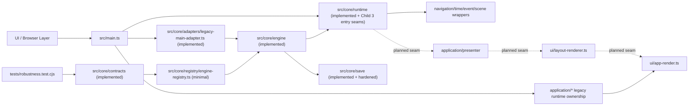
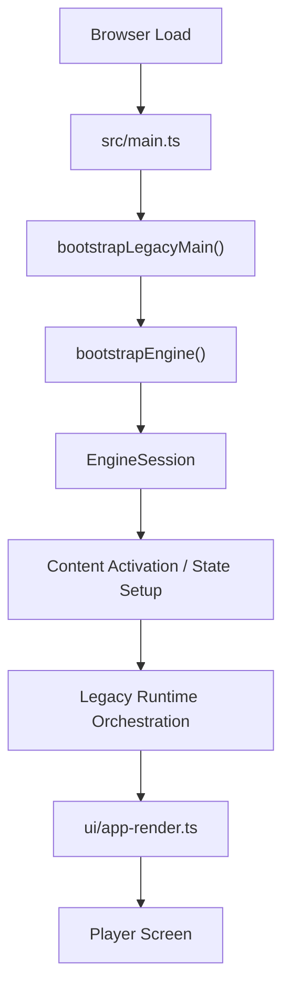
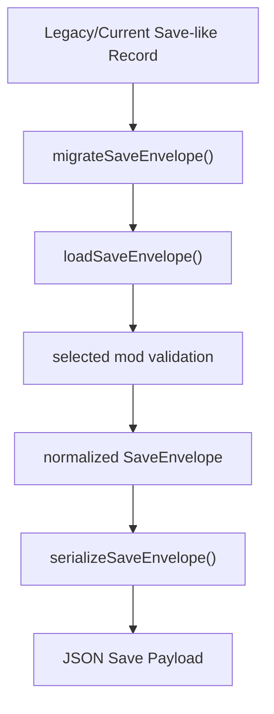
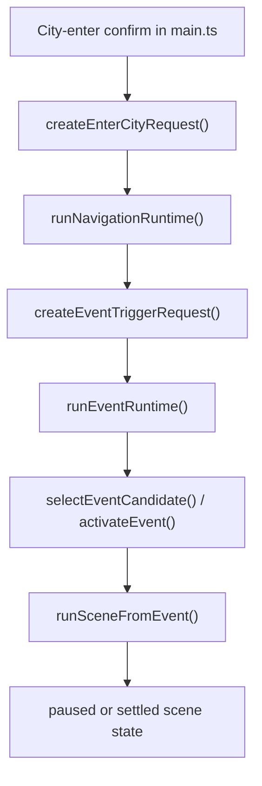

# Weekly Architecture Report

**Week Of:** `2026-06-29`

## Purpose

This report is the weekly structure snapshot.

It must show:

- the current functional module graph
- the current control-flow picture
- which parts are official modules
- which parts are still adapters or temporary seams

## Architecture Summary

- This week established the first production-safe `src/core` boundary, hardened its persistence layer, and then moved the first real navigation/time/event entry paths behind `src/core/runtime`, not just planning scaffolding.
- The current production runtime is still centered on `src/main.ts`, but `src/core/contracts`, `src/core/engine`, `src/core/runtime`, `src/core/save`, and `src/core/adapters/legacy-main-adapter.ts` now exist as concrete boundary slices with read/write persistence plus first-pass runtime entry behavior.
- The immediate next target is Child 4 interactive runtime integration, which should deepen runtime-owned interactive launch/completion ownership without reopening the newly completed persistence or Child 3 entry seams.

## Module Diagram

## Implemented Official Modules

- Plan governance documents under `docs/superpowers/plans/`
- Weekly orchestration and weekly visibility companion roles
- `src/core/contracts/*` as the first real production boundary slice
- `src/core/engine/*` as the first real selected-mod bootstrap slice
- `src/core/runtime/*` as the first real runtime-owned transition slice
- `src/core/save/*` as the first real persistence boundary slice with migration, validation, and writer ownership
- `src/core/adapters/legacy-main-adapter.ts` as the first production `main.ts -> core` handoff seam

## Approved Target Modules

- The intended `src/core` directory ownership model at the design/spec level
- Child 3 navigation/time/event extraction behind the new core runtime boundary
- Child 4 interactive runtime integration after Child 3
- Later presenter/layout extraction after runtime entry ownership improves

## Temporary Adapters

- `src/core/adapters/legacy-main-adapter.ts` is now implemented as a temporary bridge
- Legacy story/house/interactive adapters remain future work

## Flow Diagram 1: Current Boot And Render Flow

## Flow Diagram 2: Real Child 2 Save Migration Boundary

## Flow Diagram 3: Real Child 3 Navigation To Scene Handoff

## Architecture Delta This Week

- Added a formal parent plan, child boundary plan, weekly orchestration plan, and visibility companion relationship.
- Established a weekly artifact bundle for module maps, call flows, and architecture diagrams.
- Clarified that `src/core` is the official target root for engine/runtime extraction.
- Landed the first production `src/core/contracts/*` files and the first minimal `EngineRegistry` type.
- Discovered and fixed a real integration seam in `tsconfig.test.json` so test builds include the new `src/core` source root.
- Landed `src/core/engine/*` and upgraded registry typing so selected-mod boot composition is now real.
- Moved active execution into an isolated worktree to avoid shared-file collisions during later Child 1 tasks.
- Landed `src/core/runtime/*` so routed effects now settle back into core-owned state.
- Landed `src/core/save/save-envelope.ts` so selected mod identity plus mod state now have a minimal persistence seam.
- Landed `src/core/adapters/legacy-main-adapter.ts` and routed `src/main.ts` through it.
- Landed `src/core/save/save-migrations.ts`, `save-loader.ts`, and `save-writer.ts` so persistence now owns migration, validation, and round-trip serialization under `src/core`.
- Landed `src/core/runtime/navigation-runtime.ts`, `time-runtime.ts`, `event-runtime.ts`, `scene-runtime.ts`, and related seam files so navigation/time/event entry now flows through the first real runtime wrappers under `src/core`.
- Routed real city-entry, timed advancement, and trigger-driven event entry paths in `src/main.ts` through Child 3 runtime seams instead of keeping those paths fully inline.

## Architecture Risks

- `src/main.ts` is still the dominant production black box.
- `src/core` is only partially implemented, so the current architecture remains largely legacy-owned above the new boundary.
- The new contracts, engine seam, runtime seam, save seam, and adapter seam are still intentionally narrow even though persistence is hardened and Child 3 entry seams are now end-to-end validated.
- Presenter and layout seams are still conceptual until later child plans land.
