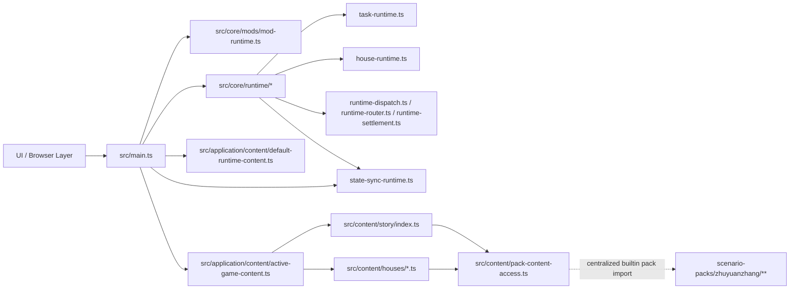
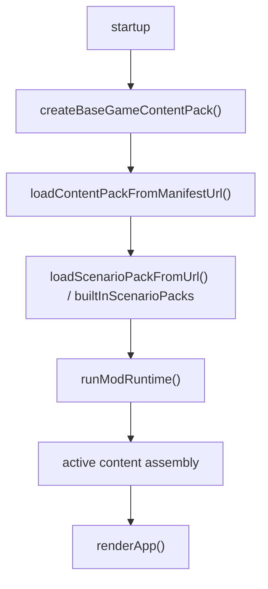
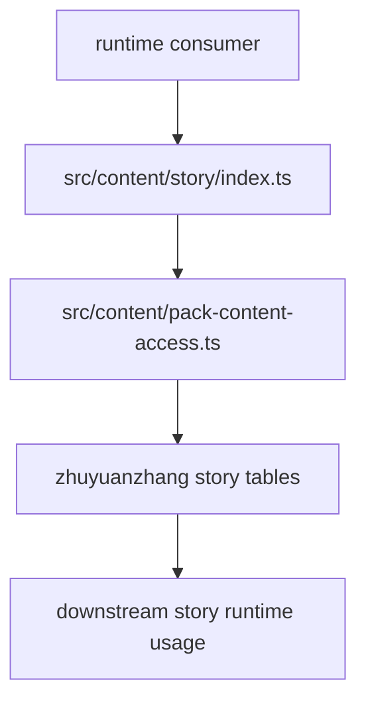
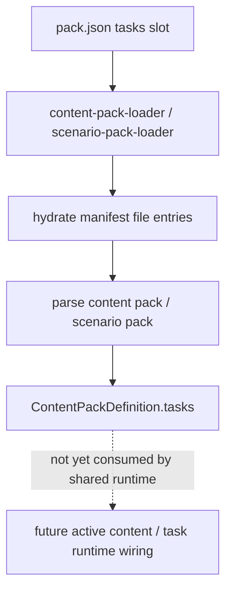
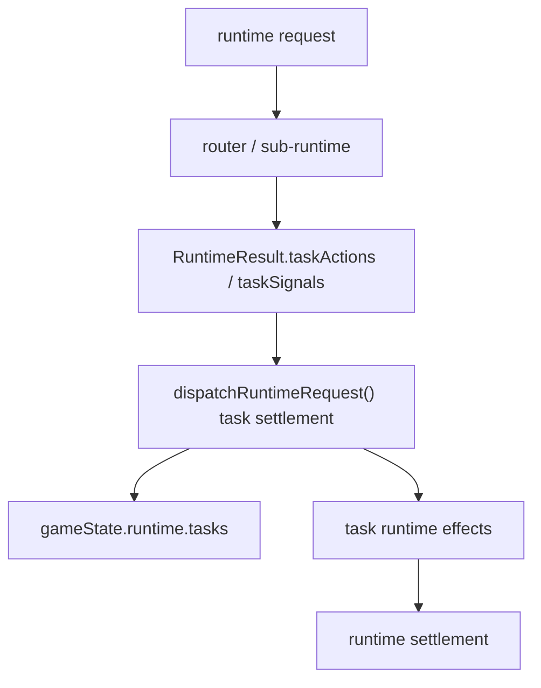

# Mod-First Weekly Architecture Report

**Week Of:** `2026-07-02`

## Purpose

This report is the weekly structure snapshot.

It must show:

- the current functional module graph
- the current control-flow picture
- which parts are official modules
- which parts are still adapters or temporary seams

## Architecture Summary

- The earlier `docs/superpowers/plans/2026-07-02-weekly-orchestration-plan.md` is closed after Child 14, Child 15, and Child 16 and remains historical truth only.
- A fresh mod-first continuation set is now opened under `docs/superpowers/plans/2026-07-02-mod-first-weekly-orchestration-plan.md`.
- The current production architecture has formal first-slice seams for navigation, time, event, scene, task, house, and mod activation, and Child 20 has now converged builtin house registration through one shared seam.
- Child 17 is now completed after converging the covered direct-import consumers onto the shared pack-content access seam.
- Child 18 is now completed after converging covered dispatch entry and covered interactive write-back onto the shared runtime commit seam.
- Child 19 is now completed after converging content-pack/scenario-pack task contribution loading, active task-definition lookup, unified task-state storage, and shared runtime task settlement.

## Current Queue State

- Weekly queue status: `open`
- Active executable child: `none currently`
- Immediate queued follow-up: `Child 21 Unified Gameplay Contribution Registry`
- Locked follow-up child: `Child 22 End-to-End Mod-First Runtime Closure`
- Planning rule: `Child 20 is closed. Recheck Child 21 before promoting any new active child.`

## Runtime / Content Maturity Snapshot

| Runtime / Boundary | Current Maturity | Current Production Role | Remaining Debt | Candidate Follow-Up |
| --- | --- | --- | --- | --- |
| `Content Access` | `covered-ownerized` | covered story, house-content, and keep-house/temple-house fallback consumers now read builtin pack-owned data through the shared pack-content access seam | the seam is still builtin-default rather than a true active-pack selector | `Child 18` later for startup/spine implications |
| `Runtime Spine` | `covered-ownerized` | dispatch/router/sub-runtime seams exist across covered runtime families and covered main.ts dispatch/write-back paths now share commitRuntimeRequest() | `src/main.ts` still owns shell-facing follow-up/render decisions outside the shared commit seam | `Child 19` later only if task work exposes new spine pressure |
| `Task Runtime` | `covered-ownerized` | task lifecycle seams exist, active content now indexes task definitions, unified game state persists task state, and shared dispatch settles typed task outputs | no full task DSL/editor or generalized contribution registry exists yet | `Child 20` later only if house work exposes new task boundary pressure |
| `House Runtime` | `covered-ownerized` | covered house lifecycle, reentry, and shared registration lookup are runtime-owned | no unified gameplay contribution install policy exists yet above the new house seam | `Child 21` later |
| `Gameplay Contribution Registry` | `placeholder` | only placeholder registry seams exist today | no unified contribution install/validation layer yet | `Child 21` later |
| `Mod-First End-To-End Closure` | `not-started` | builtin/file/url activation exists in slices | builtin startup, imported content, save restore, and runtime play do not yet prove full parity | `Child 22` later |

## Module Diagram

## Official Modules

- `src/application/content/active-game-content.ts` as the current active-content assembly line
- `src/core/mods/mod-runtime.ts` as the formal mod activation seam
- `src/core/runtime/task-runtime.ts` as the first formal task-runtime seam
- `src/core/runtime/house-runtime.ts` as the current covered house-runtime owner line
- `src/core/runtime/runtime-dispatch.ts`, `runtime-router.ts`, and `runtime-settlement.ts` as the approved shared runtime spine
- `src/core/runtime/state-sync-runtime.ts` as the shared bridge/commit seam for covered runtime request commits
- `src/application/content/content-pack-loader.ts` and `src/application/scenario/scenario-pack-loader.ts` as the shared pack-level task contribution ingress seam
- `src/core/runtime/runtime-dispatch.ts` as the shared task settlement seam for routed task actions/signals

## Temporary Adapters Or Weak Seams

- `src/content/pack-content-access.ts` is still a builtin-default adapter rather than a true active-pack selector
- `src/application/house-modules/house-module-registry.ts` is now only a wrapper over the shared core house registration seam
- `src/core/registry/content-registry.ts` and `src/core/registry/mod-registry.ts` remain placeholder-grade types ahead of Child 21
- `src/core/registry/content-registry.ts` remains a placeholder type alias rather than a real contribution registry
- `src/main.ts` remains the dominant shell/orchestration file above the new seams, but its covered runtime bridge create/apply write-back glue is now removed
- `src/main.ts` still dominates startup and many shell-facing decisions even though task settlement ownership is now below it

## Flow Diagram 1: Builtin Startup Path Before Child 17

## Flow Diagram 2: Shared Story Content Consumption After Child 17

## Flow Diagram 3: Task Contribution Loading After Child 19 Task 2

## Flow Diagram 4: Shared Task Settlement After Child 19 Task 3

## Architecture Delta This Week

- Opened a fresh mod-first continuation set instead of appending work into the closed runtime-handoff weekly set.
- Promoted Child 17 as the first active child because direct pack-content coupling was the next clearest blocker.
- Completed Child 17 by centralizing the covered default pack imports under `src/content/pack-content-access.ts`.
- Promoted Child 18 after baseline recheck narrowed the next problem to shared runtime commit/write-back residue.
- Added `commitRuntimeRequest()` under `src/core/runtime/state-sync-runtime.ts`.
- Rewired covered `main.ts` day-start, advance-segments, enter-city, story-battle, city-begging, and activity-qte write-back paths onto that shared commit seam.
- Promoted Child 19 after the post-Child-18 baseline recheck stayed unchanged.
- Added shared `tasks` contribution support to `ContentPackDefinition`, content-pack loader, and scenario-pack loader.
- Added active task-definition indexing under `active-game-content`, unified task-state storage under `gameState.runtime.tasks`, and shared task settlement inside `runtime-dispatch`.
- Rechecked Child 20 after Child 19 closeout, promoted it to active execution, and narrowed the active debt to shared house registration ownership across runtime, presenter, and view lookup.
- Completed Child 20 by adding `src/core/registry/house-module-registry.ts`, migrating covered runtime/presenter/renderer lookup onto it, and synchronizing the special-house interface contract with that shared seam.

## Architecture Risks

- `src/main.ts` is still the dominant production black box above the new seams.
- The new pack-content access seam still hardcodes the builtin default pack behind one adapter and is not yet a true active-pack selector.
- Placeholder registry seams still leave later mod-facing contribution install underdefined.
- If Child 21 ignores the new shared house registration seam and invents a parallel contribution install path, it will fragment gameplay contribution ownership again.

## Candidate Post-Queue Splits

- `Child 20 House Runtime Mod Registration`
- `Child 21 Unified Gameplay Contribution Registry`
- `Child 22 End-to-End Mod-First Runtime Closure`

These remain roadmap candidates only and are not yet part of the visible queue in this fresh set.
