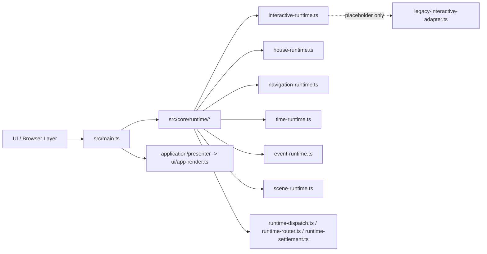
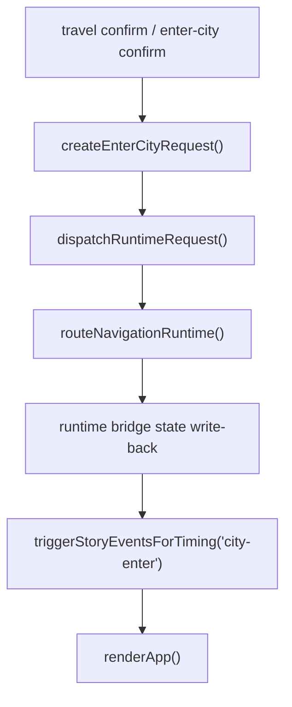
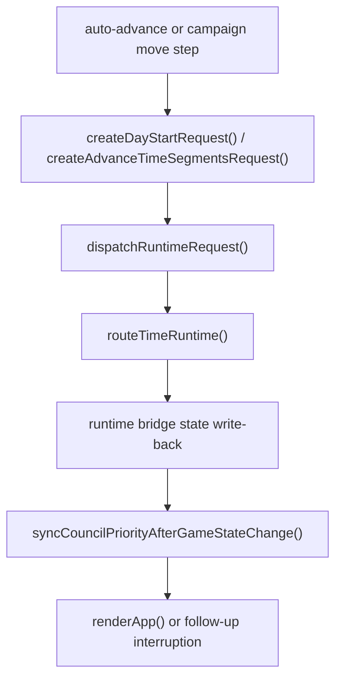

# Weekly Architecture Report

**Week Of:** `2026-07-02`

## Purpose

This report is the weekly structure snapshot.

It must show:

- the current functional module graph
- the current control-flow picture
- which parts are official modules
- which parts are still adapters or temporary seams

## Architecture Summary

- The prior `2026-06-29` weekly queue is closed after Child 13 and remains historical truth only.
- A fresh `2026-07-02` continuation set was opened, `Child 14 Interactive Remaining Legacy Convergence` is completed inside that set, and `Child 15 Navigation + Time Runtime Convergence` is now also completed.
- The current production architecture still centers on `src/main.ts`, but the covered navigation/time entry points no longer use direct shell-to-helper calls; the remaining mixed-entry debt now concentrates more clearly on event/scene handoff plus bounded follow-up residue.
- The weekly set is temporarily between active children. `Child 16 Event + Scene Handoff Convergence` is the immediate queued follow-up pending baseline recheck.
- There is no additional locked child in this set right now.

## Current Queue State

- Weekly queue status: `open`
- Active executable child: `none currently`
- Latest completed child in this set: `Child 15 Navigation + Time Runtime Convergence`
- Immediate queued follow-up: `Child 16 Event + Scene Handoff Convergence`
- Locked follow-up child: `none currently`
- Planning rule: `No queued child becomes executable automatically. Child 16 remains queued until its post-Child-15 baseline recheck is recorded and governance promotes it explicitly.`

## Runtime Maturity Snapshot

| Runtime / Boundary | Current Maturity | Current Production Role | Remaining Debt | Candidate Follow-Up |
| --- | --- | --- | --- | --- |
| `Interaction Runtime` | `covered-ownerized` | covered `city-begging`, `activity-qte`, and `story-battle` lifecycles are runtime-owned under `src/core/runtime/interactive-runtime.ts` | only placeholder-level historical residue remains in `legacy-interactive-adapter.ts`; no same-type covered lifecycle debt remains queued | none currently required |
| `House Runtime` | `owner-first-slice` | covered grain-shop lifecycle and covered follow-up reentry are runtime-owned | broader house business stays application-owned by design | none currently required |
| `Navigation Runtime` | `partial-owner` | typed runtime seam exists and the covered `enter-city` production entry now routes through shared runtime dispatch | bounded city-enter story-trigger follow-up still remains in `src/main.ts` | `Child 16 Event + Scene Handoff Convergence` |
| `Time Runtime` | `partial-owner` | typed time requests exist and the covered `day-start` / `advance-segments` production entries now route through shared runtime dispatch | bounded council-priority follow-up still remains in `src/main.ts` | `later recheck only if Child 16 does not absorb it` |
| `Event Runtime` | `partial-owner` | typed trigger/activation seam exists | mixed shell/runtime story control still remains | `Child 16 Event + Scene Handoff Convergence` |
| `Scene Runtime` | `partial-owner` | event-to-scene seam exists | scene handoff is not yet centralized on one production line | `Child 16 Event + Scene Handoff Convergence` |

## Module Diagram

## Official Modules

- `src/core/runtime/interactive-runtime.ts` as the current interactive owner target
- `src/core/runtime/house-runtime.ts` as the covered house runtime owner line
- `src/core/runtime/runtime-dispatch.ts`, `runtime-router.ts`, and `runtime-settlement.ts` as the approved shared runtime line
- `src/core/runtime/navigation-runtime.ts`, `time-runtime.ts`, `event-runtime.ts`, and `scene-runtime.ts` as provisional but formal runtime seams

## Temporary Adapters

- `src/core/adapters/legacy-main-adapter.ts` remains the boot/startup compatibility seam
- `src/core/adapters/legacy-interactive-adapter.ts` now remains only as a historical placeholder file rather than an active covered-path owner
- `src/core/adapters/legacy-house-adapter.ts` remains only as a compatibility placeholder rather than an active business owner

## Flow Diagram 1: Covered `enter-city` Navigation After Child 15

## Flow Diagram 2: Covered `day-start` / `advance-segments` Time After Child 15

## Architecture Delta This Week

- Opened a fresh weekly continuation set instead of appending new executable work into the closed Child 13 queue.
- Completed `Child 14 Interactive Remaining Legacy Convergence` and preserved it as completed queue history.
- Moved covered `activity-qte` tick/stop ownership and covered `story-battle` action dispatch ownership directly into `src/core/runtime/interactive-runtime.ts`.
- Removed the covered shell-owned `activity-qte` result-clear tail from `src/main.ts` by routing close through `createExitInteractiveRequest("activity-qte")`.
- Reduced `src/core/adapters/legacy-interactive-adapter.ts` to historical placeholder-only residue for the covered production line.
- Completed the Child 15 baseline recheck and recorded the result as narrowed to the covered `enter-city`, `day-start`, and `advance-segments` production paths.
- Landed Child 15 by routing the covered `enter-city`, `day-start`, and `advance-segments` production entries through shared runtime dispatch plus runtime bridge state helpers.
- Kept only bounded shell residue outside Child 15: city-enter story triggering and council-priority follow-up.
- Moved Child 15 into completed history and left Child 16 queued pending baseline recheck.

## Architecture Risks

- `src/main.ts` is still the dominant production black box above the new boundary.
- event/scene handoff is now the clearest next ownerization debt.
- If Child 16 absorbs unrelated time/state-sync cleanup, the new weekly set will again lose its reviewable boundary.

## Candidate Post-Queue Splits

These are continuation candidates only. They are not unlocked children unless weekly governance explicitly promotes them.

1. `Child 16 Event + Scene Handoff Convergence`
   - Primary target:
     - remaining mixed control between `runEventRuntime()` and `runSceneFromEvent()`
   - Reason to split independently:
     - Child 15 closed without absorbing this boundary, so event/scene handoff remains the next distinct problem type
   - Do not mix with:
     - additional navigation/time cleanup unless the baseline recheck proves it is inseparable

2. `Possible post-Child-15 same-type remainder only if explicitly recorded`
   - Primary target:
     - any residual covered navigation/time residue that a later baseline recheck explicitly proves cannot be consumed by Child 16
   - Reason to split independently:
     - prevent silent overflow from Child 15 into Child 16
   - Do not mix with:
     - event/scene handoff convergence
