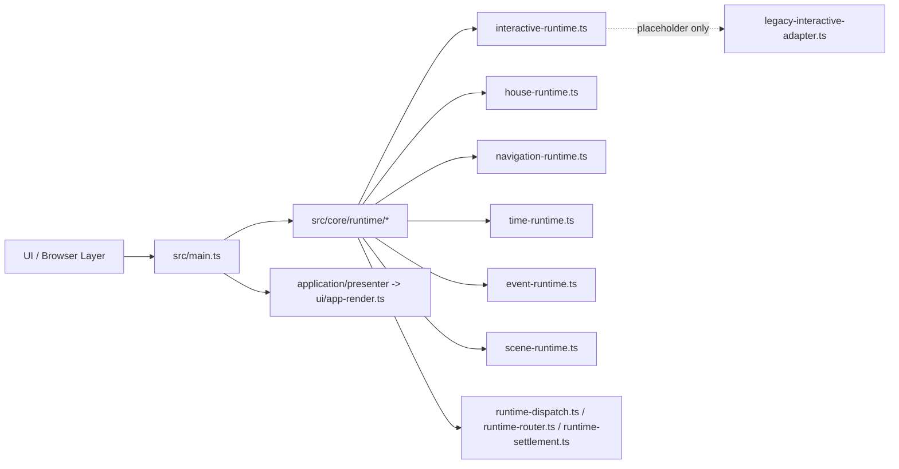
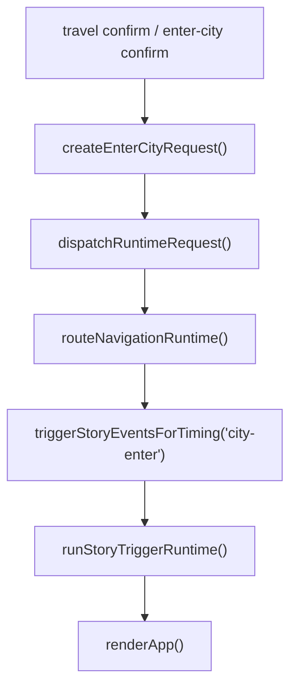
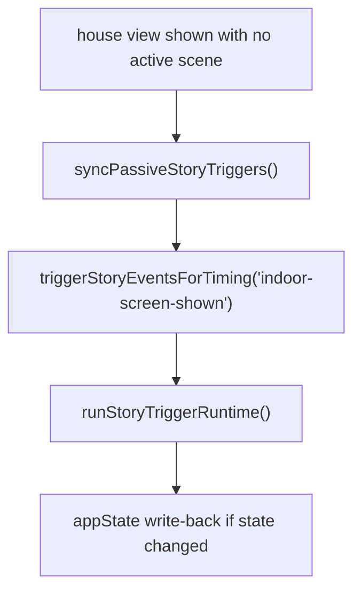

# Weekly Architecture Report

**Week Of:** `2026-07-02`

## Purpose

This report is the weekly structure snapshot.

It must show:

- the current functional module graph
- the current control-flow picture
- which parts are official modules
- which parts are still adapters or temporary seams

## Architecture Summary

- The prior `2026-06-29` weekly queue is closed after Child 13 and remains historical truth only.
- A fresh `2026-07-02` continuation set was opened, `Child 14 Interactive Remaining Legacy Convergence`, `Child 15 Navigation + Time Runtime Convergence`, and `Child 16 Event + Scene Handoff Convergence` are all completed inside that set.
- The current production architecture still centers on `src/main.ts`, but the covered navigation/time entry points and the covered story-trigger handoff line no longer use direct shell-to-helper stitching.
- The 2026-07-02 weekly set is closed because the visible queue was consumed without leaving another same-type child behind.
- There is no additional locked child in this set right now.

## Current Queue State

- Weekly queue status: `closed`
- Active executable child: `none currently`
- Latest completed child in this set: `Child 16 Event + Scene Handoff Convergence`
- Immediate queued follow-up: `none currently`
- Locked follow-up child: `none currently`
- Planning rule: `No new child may be appended into this closed set. Later continuation requires a fresh weekly review and a new weekly orchestration plan.`

## Runtime Maturity Snapshot

| Runtime / Boundary | Current Maturity | Current Production Role | Remaining Debt | Candidate Follow-Up |
| --- | --- | --- | --- | --- |
| `Interaction Runtime` | `covered-ownerized` | covered `city-begging`, `activity-qte`, and `story-battle` lifecycles are runtime-owned under `src/core/runtime/interactive-runtime.ts` | only placeholder-level historical residue remains in `legacy-interactive-adapter.ts`; no same-type covered lifecycle debt remains queued | none currently required |
| `House Runtime` | `owner-first-slice` | covered grain-shop lifecycle and covered follow-up reentry are runtime-owned | broader house business stays application-owned by design | none currently required |
| `Navigation Runtime` | `partial-owner` | typed runtime seam exists and the covered `enter-city` production entry now routes through shared runtime dispatch | bounded city-enter story-trigger follow-up is no longer shell-stitched event/scene debt; any further extraction would need a fresh review as a different problem type | none currently required |
| `Time Runtime` | `partial-owner` | typed time requests exist and the covered `day-start` / `advance-segments` production entries now route through shared runtime dispatch | bounded council-priority follow-up still remains in `src/main.ts` and would require a fresh review to justify later extraction | none currently required |
| `Event Runtime` | `partial-owner` | typed trigger/activation seam exists and covered story-trigger activation now routes through `runStoryEventRuntime()` | any later trigger-family expansion would be a different problem type, not the same covered handoff debt | none currently required |
| `Scene Runtime` | `partial-owner` | event-to-scene seam exists and covered story-trigger handoff now routes through `runStoryTriggerRuntime()` | any later scene-family continuation would need a fresh weekly review to prove it is a different problem type | none currently required |

## Module Diagram

## Official Modules

- `src/core/runtime/interactive-runtime.ts` as the current interactive owner target
- `src/core/runtime/house-runtime.ts` as the covered house runtime owner line
- `src/core/runtime/runtime-dispatch.ts`, `runtime-router.ts`, and `runtime-settlement.ts` as the approved shared runtime line
- `src/core/runtime/navigation-runtime.ts`, `time-runtime.ts`, `event-runtime.ts`, and `scene-runtime.ts` as provisional but formal runtime seams

## Temporary Adapters

- `src/core/adapters/legacy-main-adapter.ts` remains the boot/startup compatibility seam
- `src/core/adapters/legacy-interactive-adapter.ts` now remains only as a historical placeholder file rather than an active covered-path owner
- `src/core/adapters/legacy-house-adapter.ts` remains only as a compatibility placeholder rather than an active business owner

## Flow Diagram 1: Covered `city-enter` Story Handoff After Child 16

## Flow Diagram 2: Covered `indoor-screen-shown` Story Handoff After Child 16

## Architecture Delta This Week

- Opened a fresh weekly continuation set instead of appending new executable work into the closed Child 13 queue.
- Completed `Child 14 Interactive Remaining Legacy Convergence` and preserved it as completed queue history.
- Moved covered `activity-qte` tick/stop ownership and covered `story-battle` action dispatch ownership directly into `src/core/runtime/interactive-runtime.ts`.
- Removed the covered shell-owned `activity-qte` result-clear tail from `src/main.ts` by routing close through `createExitInteractiveRequest("activity-qte")`.
- Reduced `src/core/adapters/legacy-interactive-adapter.ts` to historical placeholder-only residue for the covered production line.
- Completed the Child 15 baseline recheck and recorded the result as narrowed to the covered `enter-city`, `day-start`, and `advance-segments` production paths.
- Landed Child 15 by routing the covered `enter-city`, `day-start`, and `advance-segments` production entries through shared runtime dispatch plus runtime bridge state helpers.
- Kept only bounded shell residue outside Child 15: city-enter story triggering and council-priority follow-up.
- Completed the Child 16 baseline recheck and recorded the result as narrowed to the current `triggerStoryEventsForTiming()` production line with `city-enter` and `indoor-screen-shown` call sites.
- Landed Child 16 by routing the covered story-trigger activation and event-to-scene handoff through `runStoryTriggerRuntime()`.
- Closed the 2026-07-02 set after the visible queue was consumed.

## Architecture Risks

- `src/main.ts` is still the dominant production black box above the new boundary.
- If a later continuation is still needed, it must be justified as a different problem type rather than reopening finished same-type children.
- The bounded council-priority follow-up remains outside this closed set and should not be auto-promoted without fresh review.

## Candidate Post-Queue Splits

No later child is recorded inside this closed set.

If later continuation is still needed, it must begin from a fresh weekly review and identify a different problem type than the completed Child 14 / Child 15 / Child 16 sequence.
