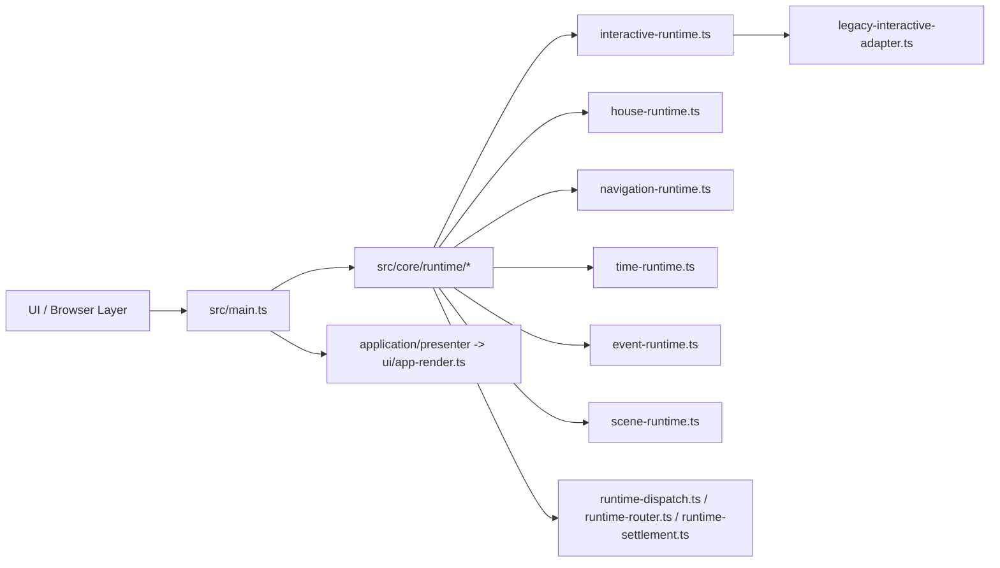
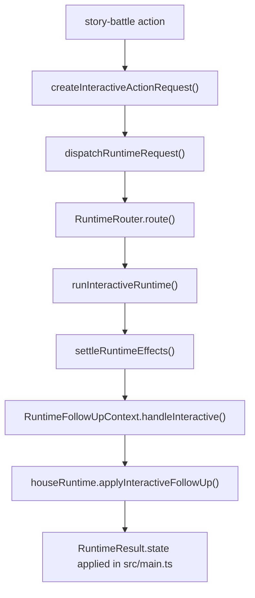
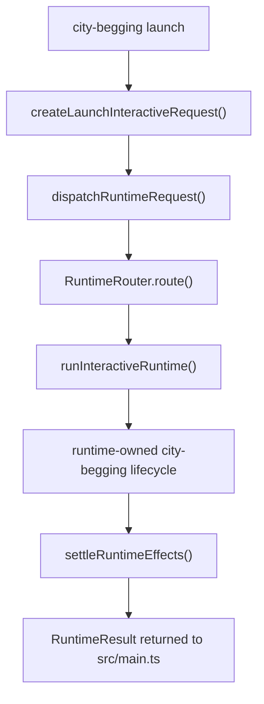

# Weekly Architecture Report

**Week Of:** `2026-07-02`

## Purpose

This report is the weekly structure snapshot.

It must show:

- the current functional module graph
- the current control-flow picture
- which parts are official modules
- which parts are still adapters or temporary seams

## Architecture Summary

- The prior `2026-06-29` weekly queue is closed after Child 13 and remains historical truth only.
- A fresh `2026-07-02` continuation set is now opened with `Child 14 Interactive Remaining Legacy Convergence` as the active executable child.
- The current production architecture still centers on `src/main.ts`, but the remaining ownerization blocker is now concentrated mainly in the interactive family rather than spread across interactive, house, and shared-dispatch follow-up paths.
- `Child 15 Navigation + Time Runtime Convergence` is now the immediate queued follow-up.
- `Child 16 Event + Scene Handoff Convergence` remains the locked later follow-up.

## Current Queue State

- Weekly queue status: `open`
- Active executable child: `Child 14 Interactive Remaining Legacy Convergence`
- Immediate queued follow-up: `Child 15 Navigation + Time Runtime Convergence`
- Locked follow-up child: `Child 16 Event + Scene Handoff Convergence`
- Planning rule: `Only Child 14 is executable in the current state. Child 15 is queued only, and Child 16 remains locked until later promotion.`

## Runtime Maturity Snapshot

| Runtime / Boundary | Current Maturity | Current Production Role | Remaining Debt | Candidate Follow-Up |
| --- | --- | --- | --- | --- |
| `Interaction Runtime` | `owner-first-slice` | covered city-begging lifecycle is runtime-owned under `src/core/runtime/interactive-runtime.ts` | `activity-qte` and `story-battle` still retain narrowed legacy lifecycle tails | `Child 14 Interactive Remaining Legacy Convergence` |
| `House Runtime` | `owner-first-slice` | covered grain-shop lifecycle and covered follow-up reentry are runtime-owned | broader house business stays application-owned by design | none currently required |
| `Navigation Runtime` | `partial-owner` | typed runtime seam exists and covered navigation entry is formalized | `src/main.ts` still directly coordinates parts of navigation flow | `Child 15 Navigation + Time Runtime Convergence` |
| `Time Runtime` | `partial-owner` | typed time requests exist and selected advance paths use them | direct shell coordination remains on covered paths | `Child 15 Navigation + Time Runtime Convergence` |
| `Event Runtime` | `partial-owner` | typed trigger/activation seam exists | mixed shell/runtime story control still remains | `Child 16 Event + Scene Handoff Convergence` |
| `Scene Runtime` | `partial-owner` | event-to-scene seam exists | scene handoff is not yet centralized on one production line | `Child 16 Event + Scene Handoff Convergence` |

## Module Diagram

## Official Modules

- `src/core/runtime/interactive-runtime.ts` as the current interactive owner target
- `src/core/runtime/house-runtime.ts` as the covered house runtime owner line
- `src/core/runtime/runtime-dispatch.ts`, `runtime-router.ts`, and `runtime-settlement.ts` as the approved shared runtime line
- `src/core/runtime/navigation-runtime.ts`, `time-runtime.ts`, `event-runtime.ts`, and `scene-runtime.ts` as provisional but formal runtime seams

## Temporary Adapters

- `src/core/adapters/legacy-main-adapter.ts` remains the boot/startup compatibility seam
- `src/core/adapters/legacy-interactive-adapter.ts` remains the main residual interactive compatibility seam and is the active Child 14 reduction target
- `src/core/adapters/legacy-house-adapter.ts` remains only as a compatibility placeholder rather than an active business owner

## Flow Diagram 1: Current Covered Story-Battle Follow-Up Line

## Flow Diagram 2: Current Covered City-Begging Runtime-Owned Lifecycle

## Architecture Delta This Week

- Opened a fresh weekly continuation set instead of appending new executable work into the closed Child 13 queue.
- Promoted `Child 14 Interactive Remaining Legacy Convergence` as the active executable child.
- Authored formal Child 15 spec/plan and added Child 15 as the immediate queued follow-up without unlocking it for execution.
- Authored formal Child 16 spec/plan and added Child 16 as the locked later follow-up without unlocking it for execution.
- Preserved `Child 16` as the locked later follow-up rather than implicitly unlocking it.

## Architecture Risks

- `src/main.ts` is still the dominant production black box above the new boundary.
- `legacy-interactive-adapter.ts` still concentrates the clearest remaining interactive ownerization debt.
- If Child 14 expands into navigation/time or event/scene work, the new weekly set will lose its reviewable boundary.

## Candidate Post-Queue Splits

These are continuation candidates only. They are not unlocked children unless weekly governance explicitly promotes them.

1. `Child 15 Navigation + Time Runtime Convergence`
   - Primary target:
     - direct shell coordination around navigation and time runtime entry paths
   - Reason to split independently:
     - it is the next progression-layer mixed entry problem after Child 14
   - Do not mix with:
     - event/scene handoff redesign or new interactive cleanup

2. `Child 16 Event + Scene Handoff Convergence`
   - Primary target:
     - remaining mixed control between `runEventRuntime()` and `runSceneFromEvent()`
   - Reason to split independently:
     - it has the highest risk of silently expanding into broader story-flow redesign
   - Do not mix with:
     - navigation/time convergence or additional interactive cleanup
